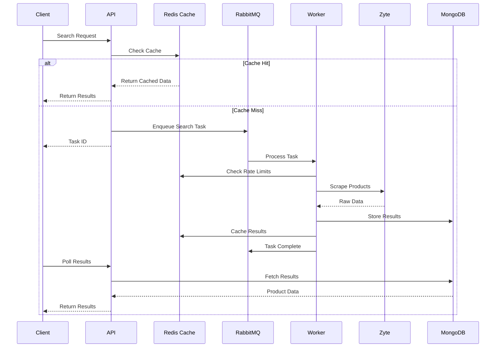
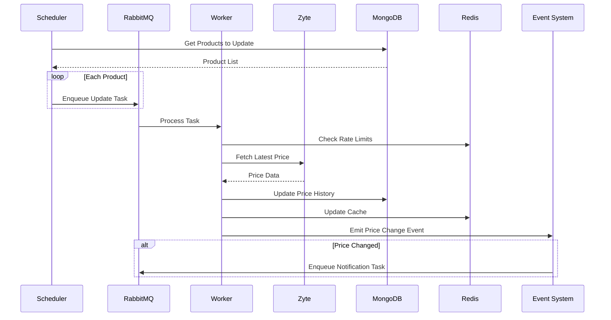

# Rust Web Scraper with Hexagonal Architecture

A robust web scraping solution built in Rust following the Hexagonal Architecture (Ports and Adapters) pattern. This architecture ensures a clean separation of concerns, making the system highly maintainable, testable, and adaptable.

## 🔄 System Overview

This distributed system orchestrates web scraping operations across multiple home improvement stores using a combination of modern technologies:

### Data Flow
1. **API Layer**: Receives scraping requests and manages the workflow
2. **Task Queue (RabbitMQ)**: 
   - Distributes scraping tasks across workers
   - Ensures reliable task processing with automatic retries
   - Handles task prioritization and load balancing
   - Enables asynchronous processing of long-running scraping operations

3. **Caching Layer (Redis)**:
   - Stores scraped product data with configurable TTL
   - Caches search results to minimize redundant scraping
   - Implements rate limiting for external APIs
   - Maintains scraping metrics and statistics

4. **Database Layer (MongoDB)**:
   - Persistent storage for product data
   - Historical price tracking
   - User preferences and search history
   - Analytics and reporting data

5. **Scraping Engine (Zyte Integration)**:
   - Leverages Zyte's smart proxy network for reliable scraping
   - Handles JavaScript rendering and browser automation
   - Manages IP rotation and request throttling
   - Provides advanced session management

### Sequence Diagrams

#### Product Search Flow


#### Price Update Flow


### Key Features
- **Parallel Scraping**: Concurrent processing of multiple stores
- **Intelligent Caching**: Minimize external requests and improve response times
- **Rate Limiting**: Respect website limits and prevent IP blocks
- **Fault Tolerance**: Automatic retries and error handling
- **Metrics & Monitoring**: Track system performance and scraping success rates

## 🏗️ Architecture Overview

This project implements the Hexagonal Architecture pattern, also known as Ports and Adapters. The architecture is organized into three main layers:

### Core Domain (Business Logic)
The heart of the application, located in `src/domain/`, contains:
- **Models**: Core business entities and value objects
- **Services**: Business logic and use cases
- **Ports**: Interface definitions for both inbound and outbound adapters
- **Events**: Domain events and event handling definitions for system-wide state changes

### Adapters (Integration Layer)
Adapters are divided into two categories:

#### Inbound Adapters (`src/adapters/inbound/`)
Drive our application:
- **API**: REST endpoints for external interaction
- **Task Processors**: Background job handlers

#### Outbound Adapters (`src/adapters/outbound/`)
Driven by our application:
- **Scrapers**: Website-specific scraping implementations
- **HTTP Clients**: External HTTP communication
- **Cache**: Redis caching implementation
- **Events System**: 
  - Event dispatching and handling infrastructure
  - Metrics collection and monitoring
  - In-memory event processing
  - Specialized event handlers (e.g., MetricsHandler)
- **Logging**: Tracing and logging implementations

### Supporting Infrastructure
- **Config**: Application configuration management
- **Error Handling**: Centralized error types and handling
- **Logging**: Structured logging setup

## 🔌 Ports (Interfaces)

### Inbound Ports
Define how external actors interact with our application:
- Task Processing Interface
- Store Operations Interface

### Outbound Ports
Define how our application interacts with external services:
- Scraper Interface
- HTTP Client Interface
- Caching Interface
- Logging Interface
- Event Handling Interface
  - Event dispatch and subscription
  - Metrics collection
  - System monitoring

## 🛠️ Implementation Details

### Domain Layer
- Pure business logic isolated from external concerns
- No dependencies on external frameworks or libraries
- Domain models and business rules
- Event definitions and handling
  - Domain events for system state changes
  - Event handler interfaces
  - Event-driven metrics collection

### Adapters Layer
- **Inbound**:
  - REST API using modern web frameworks
  - Task processing for background jobs
  
- **Outbound**:
  - Store-specific scrapers (Bricodepot, Bauhaus)
  - Redis caching implementation
  - HTTP client with Zyte integration
  - Event System:
    - In-memory event processing
    - Metrics tracking (searches, products, cache, jobs)
    - Store-specific performance monitoring
    - Failure and error tracking
  - Metrics and monitoring

## 🧪 Testing Strategy

The testing approach mirrors the hexagonal architecture:

```
tests/
├── domain/         # Unit tests for business logic
├── adapters/       # Integration tests for adapters
└── common/         # Shared testing utilities
    ├── fixtures/   # Test data
    └── mocks/      # Mock implementations
```

## 🚀 Getting Started

### Prerequisites

- Rust (latest stable version)
- Docker and Docker Compose
- A Zyte (formerly ScrapingHub) API key

### Environment Setup

1. Clone the repository:
   ```bash
   git clone <repository-url>
   cd rust_scraper
   ```

2. Copy the example environment file:
   ```bash
   cp .env.example .env
   ```

3. Configure your environment variables in `.env`:
   ```env
   # MongoDB
   MONGO_ROOT_USERNAME=admin
   MONGO_ROOT_PASSWORD=your_root_password
   MONGO_DATABASE=scraper_db
   MONGO_APP_USERNAME=app_user
   MONGO_APP_PASSWORD=your_app_password

   # Redis
   REDIS_PASSWORD=your_redis_password

   # Zyte
   ZYTE_API_KEY=your_zyte_api_key
   ```

### Infrastructure Setup

1. Start the required services:
   ```bash
   docker-compose up -d
   ```

2. Verify services are running:
   ```bash
   docker-compose ps
   ```

### Running the Application

1. Start the API server:
   ```bash
   cargo run --bin api
   ```

2. The API will be available at `http://localhost:8080`

## 📦 Dependencies

### Core Dependencies
- **Web Framework**
  - `actix-web`: Modern, high-performance web framework
  - `actix-cors`: CORS support for Actix
  - `actix-service`: Service traits for Actix

- **Authentication**
  - `jsonwebtoken`: JWT implementation
  - `bcrypt`: Password hashing
  - `base64`: Base64 encoding/decoding

- **Storage**
  - `mongodb`: MongoDB driver with async support
  - `redis`: Redis client with async support

- **Message Queue**
  - `lapin`: RabbitMQ client
  - `tokio-amqp`: Async AMQP support

- **Serialization**
  - `serde`: Serialization framework
  - `serde_json`: JSON support

- **Async Runtime**
  - `tokio`: Async runtime and utilities
  - `futures`: Future abstractions
  - `async-trait`: Async trait support

- **Utilities**
  - `chrono`: Date and time
  - `uuid`: UUID generation
  - `env_logger`: Logging
  - `thiserror`: Error handling
  - `config`: Configuration management

### Development Dependencies
- `env_logger`: Logging for development
- `validator`: Input validation
- `regex`: Regular expressions
- `anyhow`: Error handling

## 🤝 Contributing

We welcome contributions! Please follow these steps:

1. Fork the repository
2. Create a feature branch (`git checkout -b feature/amazing-feature`)
3. Commit your changes (`git commit -m 'Add amazing feature'`)
4. Push to the branch (`git push origin feature/amazing-feature`)
5. Open a Pull Request

### Development Guidelines

- Follow Rust best practices and idioms
- Ensure all tests pass (`cargo test`)
- Add tests for new features
- Update documentation as needed
- Format code using `cargo fmt`
- Run `cargo clippy` and address any issues

## 📝 License

This project is licensed under the MIT License - see the [LICENSE](LICENSE) file for details.