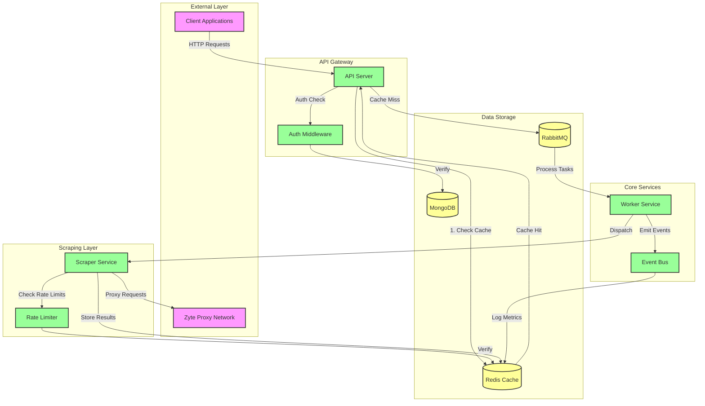
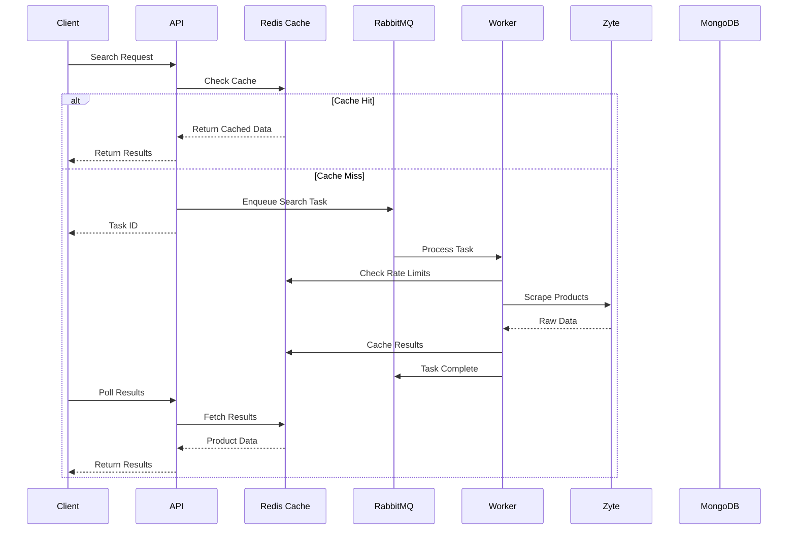
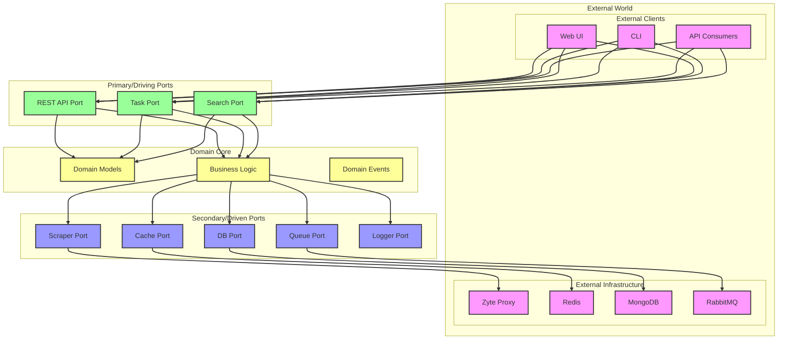
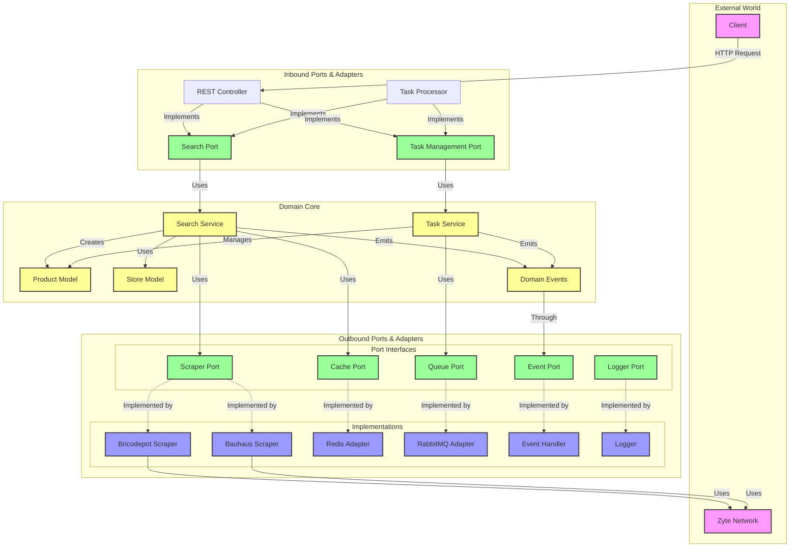

# 🌐 Rust Web Scraper

<div align="center">


<br/>
<br/>

[](https://www.rust-lang.org)
[](https://opensource.org/licenses/MIT)
[]()
[]()
[]()

<br/>

*A robust web scraping solution built in Rust following the Hexagonal Architecture pattern.*

<br/>

[📖 Documentation](docs/) •
[🚀 Quick Start](#-quick-start) •
[🏗️ Architecture](#-architecture) •
[💡 Examples](examples/) •
[🤝 Contributing](.github/CONTRIBUTING.md)

</div>

---

## 📑 Table of Contents

<details open>
<summary><strong>1. Introduction</strong></summary>

- [Overview](#-overview)
- [Key Features](#key-features)
- [Why Rust & Hexagonal Architecture?](#why-rust--hexagonal-architecture)
</details>

<details open>
<summary><strong>2. System Architecture</strong></summary>

- [High-Level Overview](#-system-overview)
- [Data Flow](#data-flow)
- [Hexagonal Architecture](#-hexagonal-architecture-implementation)
  - [Domain Core](#domain-core)
  - [Ports & Adapters](#port-interactions--data-flow)
  - [External Integrations](#external-integrations)
</details>

<details open>
<summary><strong>3. Technology Stack</strong></summary>

- [Backend Components](#backend)
  - [Core Services](#core-services)
  - [Data Storage](#data-storage)
  - [Message Queue](#message-queue)
- [Frontend Application](#-frontend-application)
- [Infrastructure](#-infrastructure)
</details>

<details open>
<summary><strong>4. Development Guide</strong></summary>

- [Quick Start](#-quick-start)
- [Prerequisites](#prerequisites)
- [Configuration](#configuration)
- [Testing Strategy](#-testing-strategy)
- [Development Workflow](#development-workflow)
</details>

<details open>
<summary><strong>5. Additional Resources</strong></summary>

- [API Documentation](docs/api.md)
- [Deployment Guide](docs/deployment.md)
- [Contributing Guidelines](.github/CONTRIBUTING.md)
- [Changelog](CHANGELOG.md)
- [License](#-license)
</details>

## 🎯 Overview

Rust Web Scraper is a high-performance, distributed web scraping system designed with clean architecture principles. It provides reliable product data extraction from multiple e-commerce sources while maintaining excellent performance and scalability.

### Key Highlights

- 🏗️ **Clean Architecture**: Hexagonal design for maintainability
- 🚀 **High Performance**: Async Rust for maximum efficiency
- 🔄 **Distributed System**: Scalable microservices architecture
- 🛡️ **Robust Design**: Comprehensive error handling and recovery
- 📊 **Real-time Metrics**: Built-in monitoring and analytics

## 🔄 System Overview

This distributed system orchestrates web scraping operations across multiple home improvement stores using a combination of modern technologies:

### Data Flow
1. **API Layer**: Receives scraping requests and manages the workflow
2. **Task Queue (RabbitMQ)**: 
   - Distributes scraping tasks across workers
   - Ensures reliable task processing with automatic retries
   - Handles task prioritization and load balancing
   - Enables asynchronous processing of long-running scraping operations

3. **Caching Layer (Redis)**:
   - Stores scraped product data with configurable TTL
   - Caches search results to minimize redundant scraping
   - Implements rate limiting for external APIs
   - Maintains scraping metrics and statistics

4. **Database Layer (MongoDB)**:
   - User authentication and authorization data
   - Session management
   - Future extensibility for product data persistence

5. **Scraping Engine (Zyte Integration)**:
   - Leverages Zyte's smart proxy network for reliable scraping
   - Handles JavaScript rendering and browser automation
   - Manages IP rotation and request throttling
   - Provides advanced session management

### System Architecture



### Sequence Diagrams

#### Product Search Flow


### Key Features
- **Parallel Scraping**: Concurrent processing of multiple stores
- **Intelligent Caching**: Minimize external requests and improve response times
- **Rate Limiting**: Respect website limits and prevent IP blocks
- **Fault Tolerance**: Automatic retries and error handling
- **Metrics & Monitoring**: Track system performance and scraping success rates

## 🏗️ Architecture Overview

This project implements the Hexagonal Architecture pattern, also known as Ports and Adapters. The architecture is organized into three main layers:

### Classic Hexagonal View


The hexagonal architecture divides the application into concentric layers:
1. **Domain Core (Center)**
   - Business logic and domain models
   - Pure business rules
   - No external dependencies

2. **Ports (Inner Hexagon)**
   - Primary (Driving) Ports: Define how external actors use our application
   - Secondary (Driven) Ports: Define how our application uses external services

3. **Adapters (Outer Hexagon)**
   - Primary Adapters: Implement interfaces for external actors
   - Secondary Adapters: Implement interfaces for external services

4. **External World (Outside)**
   - UI, API consumers, and external services
   - Infrastructure components

### Core Domain (Business Logic)
The heart of the application, located in `src/domain/`, contains:
- **Models**: Core business entities and value objects
- **Services**: Business logic and use cases
- **Ports**: Interface definitions for both inbound and outbound adapters
- **Events**: Domain events and event handling definitions for system-wide state changes

### Adapters (Integration Layer)
Adapters are divided into two categories:

#### Inbound Adapters (`src/adapters/inbound/`)
Drive our application:
- **API**: REST endpoints for external interaction
- **Task Processors**: Background job handlers

#### Outbound Adapters (`src/adapters/outbound/`)
Driven by our application:
- **Scrapers**: Website-specific scraping implementations
- **HTTP Clients**: External HTTP communication
- **Cache**: Redis caching implementation
- **Events System**: 
  - Event dispatching and handling infrastructure
  - Metrics collection and monitoring
  - In-memory event processing
  - Specialized event handlers (e.g., MetricsHandler)
- **Logging**: Tracing and logging implementations

### Supporting Infrastructure
- **Config**: Application configuration management
- **Error Handling**: Centralized error types and handling
- **Logging**: Structured logging setup

## 🔌 Hexagonal Architecture Implementation



1. ### Inbound Flow:
   - Client requests enter through REST or Task Processor adapters
   - Adapters implement inbound ports (Search, Task Management)
   - Ports delegate to domain services

2. ### Domain Core:
   - Services contain business logic
   - Models represent domain entities
   - Events handle domain state changes

3. ### Outbound Flow:
   - Services use outbound ports for external operations
   - Each port has specific adapters implementing it
   - Adapters interact with external services

4. ### Port Implementation:
   - Clear separation between port interfaces and implementations
   - Multiple implementations possible for each port
   - External services accessed only through adapters

## 🧪 Testing Strategy

The testing approach mirrors the hexagonal architecture:

```
tests/
├── domain/         # Unit tests for business logic
├── adapters/       # Integration tests for adapters
└── common/         # Shared testing utilities
    ├── fixtures/   # Test data
    └── mocks/      # Mock implementations
```

## 🚀 Getting Started

### Prerequisites

- Rust (latest stable version)
- Docker and Docker Compose
- A Zyte (formerly ScrapingHub) API key

### Environment Setup

1. Clone the repository:
   ```bash
   git clone <repository-url>
   cd rust_scraper
   ```

2. Copy the example environment file:
   ```bash
   cp .env.example .env
   ```

3. Configure your environment variables in `.env`:
   ```env
   # MongoDB
   MONGO_ROOT_USERNAME=admin
   MONGO_ROOT_PASSWORD=your_root_password
   MONGO_DATABASE=scraper_db
   MONGO_APP_USERNAME=app_user
   MONGO_APP_PASSWORD=your_app_password

   # Redis
   REDIS_PASSWORD=your_redis_password

   # Zyte
   ZYTE_API_KEY=your_zyte_api_key
   ```

### Infrastructure Setup

1. Start the required services:
   ```bash
   docker-compose up -d
   ```

2. Verify services are running:
   ```bash
   docker-compose ps
   ```

### Running the Application

1. Start the API server:
   ```bash
   cargo run --bin api
   ```

2. The API will be available at `http://localhost:8080`

## 📦 Dependencies

### Core Dependencies
- **Web Framework**
  - `actix-web`: Modern, high-performance web framework
  - `actix-cors`: CORS support for Actix
  - `actix-service`: Service traits for Actix

- **Authentication**
  - `jsonwebtoken`: JWT implementation
  - `bcrypt`: Password hashing
  - `base64`: Base64 encoding/decoding

- **Storage**
  - `mongodb`: MongoDB driver with async support
  - `redis`: Redis client with async support

- **Message Queue**
  - `lapin`: RabbitMQ client
  - `tokio-amqp`: Async AMQP support

- **Serialization**
  - `serde`: Serialization framework
  - `serde_json`: JSON support

- **Async Runtime**
  - `tokio`: Async runtime and utilities
  - `futures`: Future abstractions
  - `async-trait`: Async trait support

- **Utilities**
  - `chrono`: Date and time
  - `uuid`: UUID generation
  - `env_logger`: Logging
  - `thiserror`: Error handling
  - `config`: Configuration management

### Development Dependencies
- `env_logger`: Logging for development
- `validator`: Input validation
- `regex`: Regular expressions
- `anyhow`: Error handling

## 🤝 Frontend Application

The frontend is built with modern web technologies to provide a responsive and intuitive user interface:

### Technology Stack
- **Framework**: React with TypeScript
- **State Management**: Redux Toolkit
- **Styling**: Tailwind CSS
- **API Integration**: Axios with custom request interceptors
- **Real-time Updates**: WebSocket for live scraping status

### Key Features
- **Responsive Design**: Mobile-first approach
- **Real-time Updates**: Live progress of scraping tasks
- **Advanced Search**: Filters and sorting capabilities
- **Product Comparison**: Side-by-side product comparison
- **Dark/Light Mode**: Theme customization
- **Authentication**: JWT-based auth with secure storage

### Component Architecture
- Atomic design pattern
- Reusable UI components
- Type-safe props and state
- Lazy loading for optimal performance

## 🏗️ Infrastructure

The application infrastructure is managed using Infrastructure as Code (IaC) with Terraform. For detailed infrastructure documentation and setup, please refer to the [infrastructure documentation](./infrastructure/README.md).

## 🤝 Contributing

We welcome contributions! Please follow these steps:

1. Fork the repository
2. Create a feature branch (`git checkout -b feature/amazing-feature`)
3. Commit your changes (`git commit -m 'Add amazing feature'`)
4. Push to the branch (`git push origin feature/amazing-feature`)
5. Open a Pull Request

### Development Guidelines

- Follow Rust best practices and idioms
- Ensure all tests pass (`cargo test`)
- Add tests for new features
- Update documentation as needed
- Format code using `cargo fmt`
- Run `cargo clippy` and address any issues

## 📝 License

This project is licensed under the MIT License - see the [LICENSE](LICENSE) file for details.

## 🛠️ Technology Stack

### Backend
- **Core**: Rust 1.70+
- **Web Framework**: Actix-web 4.0
- **Database**: MongoDB 6.0
- **Cache**: Redis 7.2
- **Message Queue**: RabbitMQ 3.12
- **Proxy Service**: Zyte Smart Proxy

### Frontend
- **Framework**: React 18 with TypeScript
- **State**: Redux Toolkit
- **Styling**: Tailwind CSS
- **Real-time**: WebSocket

### Infrastructure
- **IaC**: Terraform
- **Containers**: Docker
- **CI/CD**: GitHub Actions
- **Monitoring**: Prometheus & Grafana

## 📚 Documentation

Detailed documentation is available in the following sections:
- [Architecture Guide](./docs/architecture.md)
- [API Documentation](./docs/api.md)
- [Development Guide](./docs/development.md)
- [Deployment Guide](./docs/deployment.md)