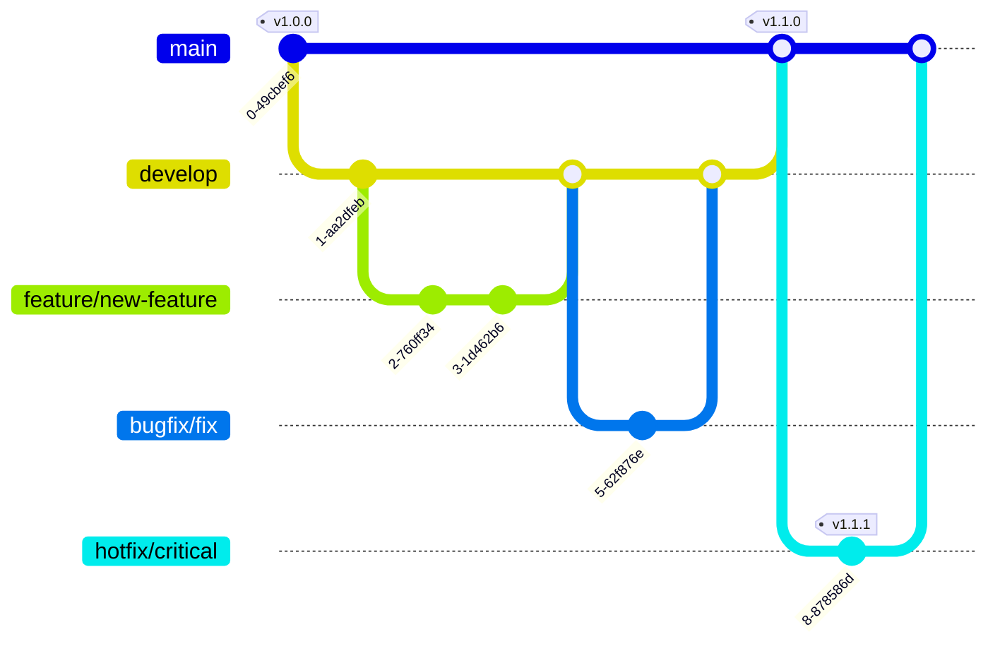

# 🕷️ Rust Scraper Project

[](https://github.com/your-org/rust-scraper/actions)
[](https://opensource.org/licenses/MIT)
[](https://www.rust-lang.org)
[](https://www.terraform.io)
[](https://codecov.io/gh/your-org/rust-scraper)
[](https://deps.rs/repo/github/your-org/rust-scraper)
[](https://hub.docker.com/r/your-org/rust-scraper)
[](https://docs.rs/rust-scraper)

<div align="center">

> 🚀 A high-performance, distributed web scraping system built with Rust 🦀, featuring task processing, caching, and high availability for production environments.

[Getting Started](#-quick-start) •
[Features](#-features) •
[Documentation](#-documentation) •
[Contributing](#-contributing)

</div>

---

## ✨ Features

<div align="center">

| Feature | Description |
|---------|-------------|
| 🚀 **High Performance** | Built with Rust for maximum efficiency and low resource usage |
| 🔄 **Distributed Processing** | RabbitMQ-based task distribution for scalable operations |
| 💾 **Smart Caching** | Redis-backed caching system with intelligent invalidation |
| ⚡ **Scalable Architecture** | From development to production-ready infrastructure |
| 🛡️ **Enterprise Security** | End-to-end security with AWS best practices |
| 💰 **Cost Optimization** | Optimized for AWS free tier in development |
| 🔍 **Flexible Scraping** | Support for multiple scraping strategies and patterns |
| 📊 **Rich Analytics** | Built-in metrics and monitoring capabilities |

</div>

## 🏗️ Architecture

```mermaid
graph TB
    subgraph AWS["AWS Region (us-east-1)"]
        subgraph VPC["VPC (10.0.0.0/16)"]
            subgraph Public["Public Subnet"]
                EC2["EC2 t2.micro"]
                subgraph Docker["Docker Containers"]
                    Redis["Redis"]
                    RMQ["RabbitMQ"]
                end
            end
        end
    end

    style AWS fill:#232F3E,stroke:#FF9900,stroke-width:2px
    style VPC fill:#FF9900,stroke:#232F3E,stroke-width:2px
    style Public fill:#FFFFFF,stroke:#232F3E,stroke-width:2px
    style EC2 fill:#D86613,stroke:#232F3E,stroke-width:2px
    style Docker fill:#2496ED,stroke:#232F3E,stroke-width:2px
```

<details>
<summary><b>Development Environment</b></summary>


</details>

<details>
<summary><b>Production Environment</b></summary>


</details>

```mermaid
graph TB
    subgraph AWS["AWS Region (us-east-1)"]
        subgraph VPC["VPC (10.1.0.0/16)"]
            subgraph AZ1["Availability Zone 1"]
                Redis1["Redis Primary"]
                RMQ1["RabbitMQ Primary"]
                ASG1["Auto Scaling Group"]
            end
            subgraph AZ2["Availability Zone 2"]
                Redis2["Redis Replica"]
                RMQ2["RabbitMQ Secondary"]
                ASG2["Auto Scaling Group"]
            end
            ALB["Application Load Balancer"]
        end
    end

    style AWS fill:#232F3E,stroke:#FF9900,stroke-width:2px
    style VPC fill:#FF9900,stroke:#232F3E,stroke-width:2px
    style AZ1 fill:#FFFFFF,stroke:#232F3E,stroke-width:2px
    style AZ2 fill:#FFFFFF,stroke:#232F3E,stroke-width:2px
    style ALB fill:#D86613,stroke:#232F3E,stroke-width:2px
```

## 🚀 Quick Start

### System Requirements

<div align="center">

| Tool      | Version | Purpose | Installation |
|-----------|---------|----------|--------------|
| Rust      | stable  | Core development | [Install](https://rustup.rs/) |
| Docker    | latest  | Local services | [Install](https://docs.docker.com/get-docker/) |
| AWS CLI   | v2      | Cloud management | [Install](https://aws.amazon.com/cli/) |
| Terraform | ≥1.0.0  | Infrastructure | [Install](https://www.terraform.io/downloads.html) |

</div>

### Development Setup

1️⃣ **Clone and Setup**
```bash
# Clone the repository
git clone https://github.com/your-org/rust-scraper.git
cd rust-scraper

# Install dependencies
cargo install --path .
```

2️⃣ **Configure AWS**
```bash
aws configure  # Set up your AWS credentials
```

3️⃣ **Initialize Infrastructure**
```bash
# Setup Terraform backend
cd terraform/bootstrap
terraform init && terraform apply

# Deploy development environment
cd ../environments/dev
cp terraform.tfvars.example terraform.tfvars
# Edit terraform.tfvars with your IP
terraform init && terraform apply
```

4️⃣ **Run the Application**
```bash
cargo run  # Start the application
```

## 🌳 Branch Strategy

<div align="center">



</div>

## 🔄 CI/CD Pipeline

<div align="center">

| Stage | Development | Production | Description |
|-------|------------|------------|-------------|
| Build | ✅ Automatic | ✅ Automatic | Compile and package application |
| Test | ✅ Automatic | ✅ Automatic | Run unit and integration tests |
| Security Scan | ✅ Automatic | ✅ Automatic | Vulnerability assessment |
| Deploy | ✅ Automatic | ⚡ Manual Approval | Environment deployment |
| Rollback | ✅ Automatic | ✅ Automatic | Failure recovery |

</div>

## 📁 Project Structure

<details>
<summary><b>Expand Project Tree</b></summary>

```
├── 📂 src/
│   ├── 📂 api/          # RESTful API endpoints
│   ├── 📂 core/         # Core business logic
│   ├── 📂 scrapers/     # Scraping implementations
│   ├── 📂 workers/      # Async task processors
│   ├── 📂 clients/      # External service clients
│   └── 📂 utils/        # Shared utilities
├── 📂 terraform/
│   ├── 📂 bootstrap/    # Backend configuration
│   ├── 📂 modules/      # Reusable components
│   └── 📂 environments/ # Environment configs
└── 📂 docs/
    └── 📂 infrastructure/  # Technical documentation
```
</details>

## 💰 Cost Management

<div align="center">

| Resource | Development | Production | Optimization Tips |
|----------|------------|------------|------------------|
| Compute | Free tier | ~$52/month | Use spot instances |
| Storage | Free tier | ~$20/month | Enable lifecycle policies |
| Network | ~$0-5/month | ~$64/month | Configure VPC endpoints |
| Services | ~$0-5/month | ~$244/month | Use reserved instances |
| **Total** | **~$0-10/month** | **~$380/month** | Potential 30% savings |

</div>

## 🔐 Security Features

<div align="center">

| Category | Features | Implementation |
|----------|----------|----------------|
| 🔒 **Infrastructure** | Private subnets<br>Security groups<br>VPC endpoints | AWS Security Best Practices |
| 🔑 **Authentication** | AWS IAM roles<br>Service credentials<br>API authentication | Zero-trust Architecture |
| 🛡️ **Data Protection** | Encryption at rest<br>Encryption in transit<br>Secrets management | AWS KMS Integration |

</div>

## 📚 Documentation

<div align="center">

| Document | Description | Audience |
|----------|-------------|----------|
| [Infrastructure](docs/infrastructure/README.md) | Detailed setup guide | DevOps Engineers |
| [Architecture](docs/infrastructure/ARCHITECTURE.md) | System design | System Architects |
| [Contributing](docs/CONTRIBUTING.md) | Development guide | Developers |

</div>

## 🤝 Contributing

We welcome contributions! Please see our [Contributing Guidelines](docs/CONTRIBUTING.md).

<details>
<summary><b>Contribution Process</b></summary>

1. Fork the repository
2. Create your feature branch (`git checkout -b feature/amazing-feature`)
3. Commit your changes (`git commit -m 'feat: add amazing feature'`)
4. Push to the branch (`git push origin feature/amazing-feature`)
5. Open a Pull Request

</details>

## 📄 License

This project is licensed under the MIT License - see the [LICENSE](LICENSE) file for details.

---

<div align="center">

**[Website](https://your-org.com)** •
**[Documentation](https://docs.your-org.com)** •
**[Report Bug](https://github.com/your-org/rust-scraper/issues)** •
**[Request Feature](https://github.com/your-org/rust-scraper/issues)**

Made with ❤️ by Your Organization

</div>