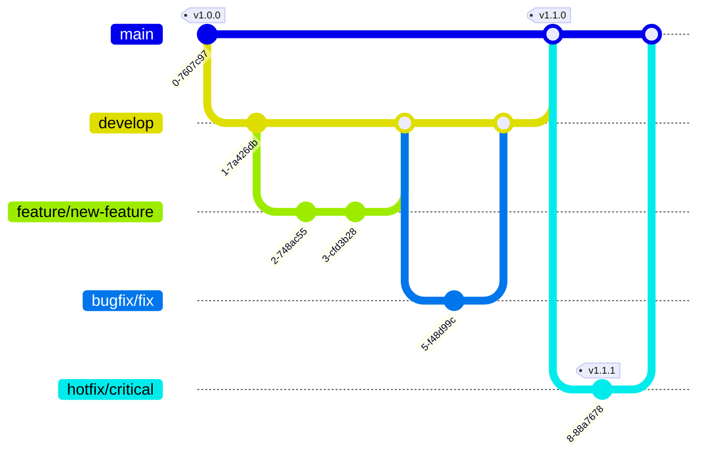
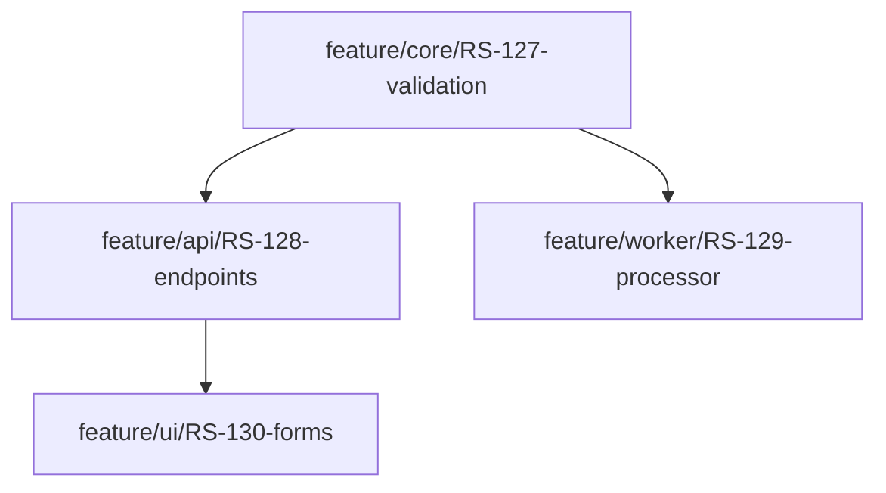
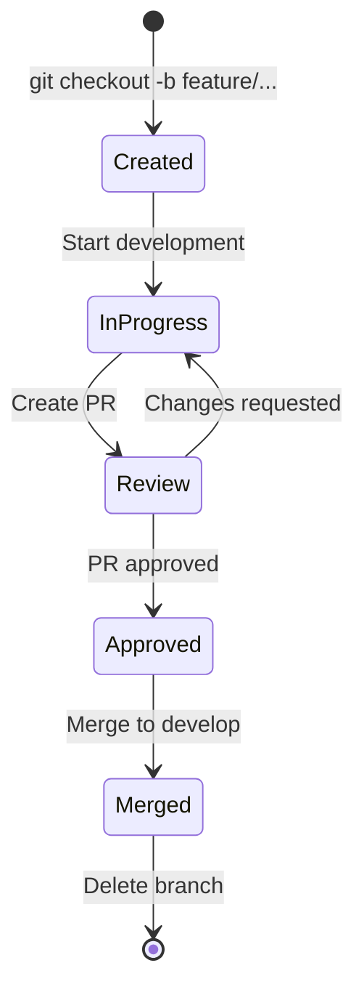
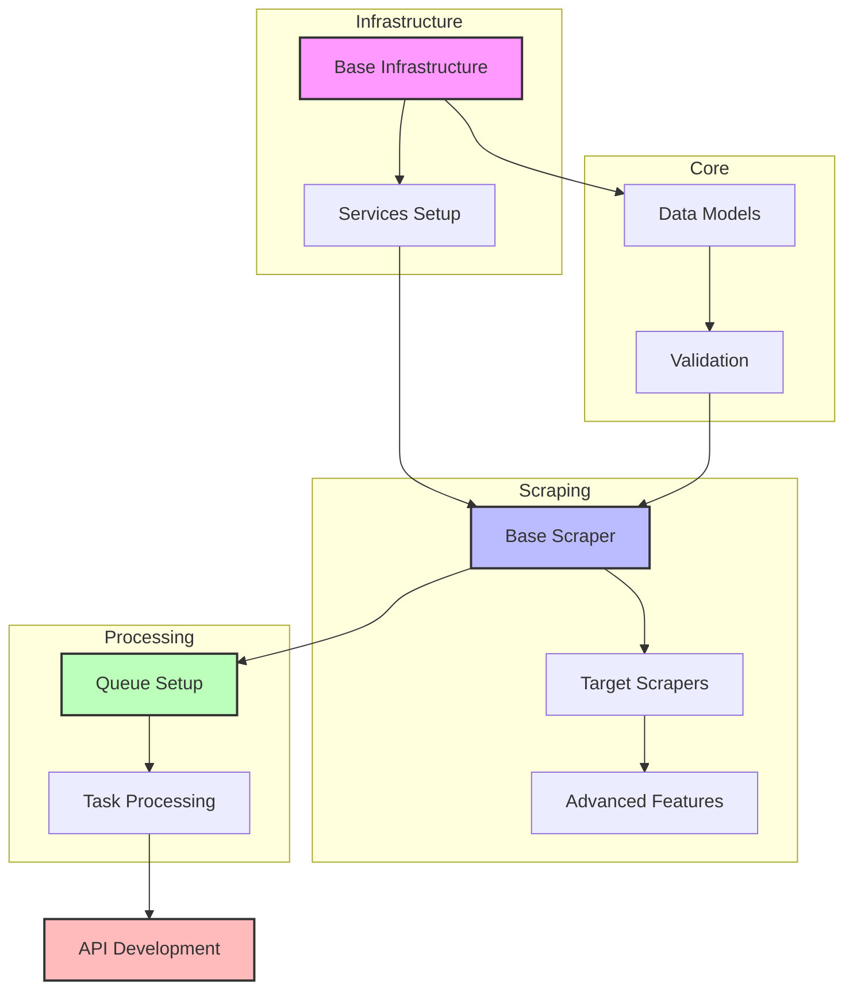

# 🌳 Branching Strategy

## Overview

This document outlines our Git branching strategy, which follows a modified GitFlow approach optimized for continuous delivery while maintaining stability and quality.



## 🔀 Branch Types

### Main Branches

| Branch | Purpose | Protected | Auto-deploy |
|--------|---------|-----------|-------------|
| `main` | Production code | ✅ Yes | 🚀 Production |
| `develop` | Integration branch | ✅ Yes | 🚀 Development |

### Supporting Branches

| Branch Pattern | Purpose | Source Branch | Target Branch | Lifecycle |
|----------------|---------|---------------|---------------|-----------|
| `feature/*` | New features | `develop` | `develop` | Temporary |
| `bugfix/*` | Bug fixes | `develop` | `develop` | Temporary |
| `hotfix/*` | Critical fixes | `main` | `main` & `develop` | Temporary |
| `release/*` | Release preparation | `develop` | `main` | Temporary |

## 📋 Branch Naming Convention

### Format
```
<type>/<ticket-number>-<short-description>
```

### Examples
- `feature/RS-123-add-redis-caching`
- `bugfix/RS-456-fix-memory-leak`
- `hotfix/RS-789-critical-security-fix`
- `release/v2.0.0`

## 🔒 Branch Protection Rules

### Main Branch (`main`)
- ✅ Require pull request reviews
- ✅ Require status checks to pass
- ✅ Require linear history
- ✅ Include administrators
- ❌ Allow force pushes
- ❌ Allow deletions

### Development Branch (`develop`)
- ✅ Require pull request reviews
- ✅ Require status checks to pass
- ✅ Allow force pushes (with lease)
- ❌ Allow deletions

## 🔄 Workflow Processes

### Feature Development
1. Create feature branch from `develop`
   ```bash
   git checkout develop
   git pull origin develop
   git checkout -b feature/RS-123-new-feature
   ```

2. Develop and commit changes
   ```bash
   git add .
   git commit -m "feat: add new feature"
   ```

3. Push changes and create PR
   ```bash
   git push origin feature/RS-123-new-feature
   # Create PR to develop
   ```

### Hotfix Process
1. Create hotfix branch from `main`
   ```bash
   git checkout main
   git pull origin main
   git checkout -b hotfix/RS-789-critical-fix
   ```

2. Fix and commit changes
   ```bash
   git add .
   git commit -m "fix: critical issue"
   ```

3. Push changes and create PRs
   ```bash
   git push origin hotfix/RS-789-critical-fix
   # Create PR to main AND develop
   ```

### Release Process
1. Create release branch
   ```bash
   git checkout develop
   git pull origin develop
   git checkout -b release/v2.0.0
   ```

2. Version bump and final fixes
   ```bash
   # Update version numbers
   git add .
   git commit -m "chore: bump version to 2.0.0"
   ```

3. Create PR and merge
   ```bash
   # Create PR to main
   # After merge, tag the release
   git tag -a v2.0.0 -m "Version 2.0.0"
   git push origin v2.0.0
   ```

## 🏷️ Commit Message Convention

### Format
```
<type>(<scope>): <description>

[optional body]

[optional footer]
```

### Types
- `feat`: New feature
- `fix`: Bug fix
- `docs`: Documentation
- `style`: Formatting
- `refactor`: Code restructuring
- `test`: Adding tests
- `chore`: Maintenance

### Examples
```bash
feat(api): add new endpoint for scraping
fix(worker): resolve memory leak in task processor
docs(readme): update installation instructions
```

## 🔍 Code Review Process

### Pull Request Requirements
- ✅ Passes all automated checks
- ✅ Follows naming convention
- ✅ Has clear description
- ✅ Links to relevant tickets
- ✅ Updates documentation
- ✅ Includes tests

### Review Checklist
- [ ] Code follows style guide
- [ ] Tests cover new/modified code
- [ ] Documentation is updated
- [ ] No security vulnerabilities
- [ ] Performance impact considered

## 🚀 Deployment Flow

### Development
- Automatic deployment on merge to `develop`
- Deploys to development environment
- No manual approval required

### Production
- Manual approval required
- Deploys to production environment
- Requires successful staging tests
- Automated rollback on failure

## 📊 Branch Lifecycle Management

### Cleanup Policy
- Delete feature branches after merge
- Archive release branches
- Keep hotfix branches for audit
- Clean stale branches weekly

### Stale Branch Criteria
- No commits for 30 days
- PR closed/merged
- No active development 

## 🎯 Feature Branch Organization

### Naming Structure
```
feature/<domain>/<ticket-number>-<description>
```

### Domain Categories
| Domain | Purpose | Example |
|--------|---------|---------|
| `api` | API-related features | `feature/api/RS-123-add-scraping-endpoint` |
| `worker` | Background worker features | `feature/worker/RS-124-task-processor` |
| `scraper` | Scraping implementations | `feature/scraper/RS-125-amazon-parser` |
| `infra` | Infrastructure changes | `feature/infra/RS-126-redis-cluster` |
| `core` | Core business logic | `feature/core/RS-127-data-validation` |
| `ui` | User interface features | `feature/ui/RS-128-dashboard` |

### Feature Branch Guidelines

#### 1. Scope and Size
- 🎯 Single responsibility principle
- 📏 2-5 days of work maximum
- 🔄 If larger, break into sub-features

#### 2. Organization Examples
```bash
# API Feature
feature/api/RS-123-add-scraping-endpoint

# Complex Feature with Sub-features
feature/worker/RS-124-task-processor
feature/worker/RS-124.1-queue-handler
feature/worker/RS-124.2-result-processor

# Cross-domain Feature
feature/core-api/RS-125-validation-endpoints
```

#### 3. Dependencies Between Features


### Feature Development Workflow

#### 1. Starting a New Feature
```bash
# Update develop branch
git checkout develop
git pull origin develop

# Create feature branch with domain
git checkout -b feature/api/RS-123-scraping-endpoint
```

#### 2. Working with Sub-features
```bash
# Main feature branch
git checkout -b feature/worker/RS-124-task-processor

# Sub-feature branches
git checkout -b feature/worker/RS-124.1-queue-handler
git checkout -b feature/worker/RS-124.2-result-processor
```

#### 3. Feature Integration
```bash
# Merge sub-features into main feature
git checkout feature/worker/RS-124-task-processor
git merge feature/worker/RS-124.1-queue-handler
git merge feature/worker/RS-124.2-result-processor

# Create PR to develop
```

### Best Practices

#### 1. Feature Isolation
- ✅ Each feature branch should be independent
- ✅ Minimize dependencies between features
- ✅ Use feature flags for dependent features

#### 2. Regular Integration
- 📅 Rebase with develop daily
- 🔄 Push changes frequently
- 🔍 Create draft PRs early

#### 3. Documentation
- 📝 Update API documentation
- 🔧 Include configuration changes
- 📊 Add architecture diagrams if needed

#### 4. Testing Strategy
| Test Type | When to Write | Example |
|-----------|---------------|---------|
| Unit Tests | During development | `test_scraper_validation` |
| Integration Tests | Before PR | `test_api_scraper_flow` |
| E2E Tests | For critical paths | `test_complete_scraping_cycle` |

### Feature Branch Lifecycle



## 📋 Project-Specific Feature Branches

### 1. Infrastructure Setup
```bash
# Base Infrastructure
feature/infra/RS-001-terraform-base-setup
feature/infra/RS-002-networking-setup
feature/infra/RS-003-security-groups

# Services Setup
feature/infra/RS-004-redis-setup
feature/infra/RS-005-rabbitmq-setup
feature/infra/RS-006-monitoring-setup
```

### 2. Core Components
```bash
# Data Models and Validation
feature/core/RS-010-scraping-models
feature/core/RS-011-validation-rules
feature/core/RS-012-error-handling

# Configuration Management
feature/core/RS-013-config-management
feature/core/RS-014-env-management
```

### 3. Scraper Implementation
```bash
# Base Scraper
feature/scraper/RS-020-base-scraper
feature/scraper/RS-021-http-client
feature/scraper/RS-022-rate-limiter

# Target-Specific Scrapers
feature/scraper/RS-023-amazon-scraper
feature/scraper/RS-024-ebay-scraper
feature/scraper/RS-025-walmart-scraper

# Scraping Features
feature/scraper/RS-026-proxy-rotation
feature/scraper/RS-027-captcha-handling
feature/scraper/RS-028-data-extraction
```

### 4. Worker System
```bash
# Queue Management
feature/worker/RS-030-queue-setup
feature/worker/RS-031-task-distribution
feature/worker/RS-032-result-collection

# Processing
feature/worker/RS-033-task-processor
feature/worker/RS-034-retry-mechanism
feature/worker/RS-035-error-handling
```

### 5. API Development
```bash
# Core API
feature/api/RS-040-api-setup
feature/api/RS-041-auth-middleware
feature/api/RS-042-rate-limiting

# Endpoints
feature/api/RS-043-scraping-endpoints
feature/api/RS-044-results-endpoints
feature/api/RS-045-status-endpoints
```

### 6. Caching System
```bash
# Redis Implementation
feature/cache/RS-050-redis-client
feature/cache/RS-051-cache-strategy
feature/cache/RS-052-invalidation

# Cache Features
feature/cache/RS-053-result-caching
feature/cache/RS-054-rate-limit-cache
```

### 7. Monitoring and Logging
```bash
# Monitoring
feature/monitoring/RS-060-metrics-setup
feature/monitoring/RS-061-alerting
feature/monitoring/RS-062-dashboards

# Logging
feature/monitoring/RS-063-log-management
feature/monitoring/RS-064-error-tracking
```

### Development Order and Dependencies



### Implementation Phases

1. **Phase 1: Foundation** 🏗️
   - Infrastructure setup
   - Core data models
   - Basic configuration

2. **Phase 2: Core Functionality** 🔨
   - Base scraper implementation
   - Queue system setup
   - Basic worker functionality

3. **Phase 3: Features** 🚀
   - Target-specific scrapers
   - Advanced scraping features
   - Caching implementation

4. **Phase 4: API & Integration** 🔌
   - API development
   - Monitoring setup
   - System integration

### Branch Dependencies Management

For features that depend on each other, we use the following approach:

1. **Independent Development**
   ```bash
   # Can be developed in parallel
   feature/infra/RS-001-terraform-base-setup
   feature/core/RS-010-scraping-models
   ```

2. **Dependent Features**
   ```bash
   # Must wait for base scraper
   feature/scraper/RS-020-base-scraper
   feature/scraper/RS-023-amazon-scraper  # Depends on base
   ```

3. **Feature Flags**
   ```bash
   # For features that might not be ready
   feature/scraper/RS-027-captcha-handling
   feature/cache/RS-054-rate-limit-cache
   ```
