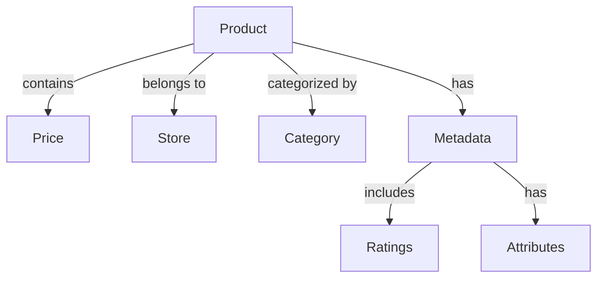
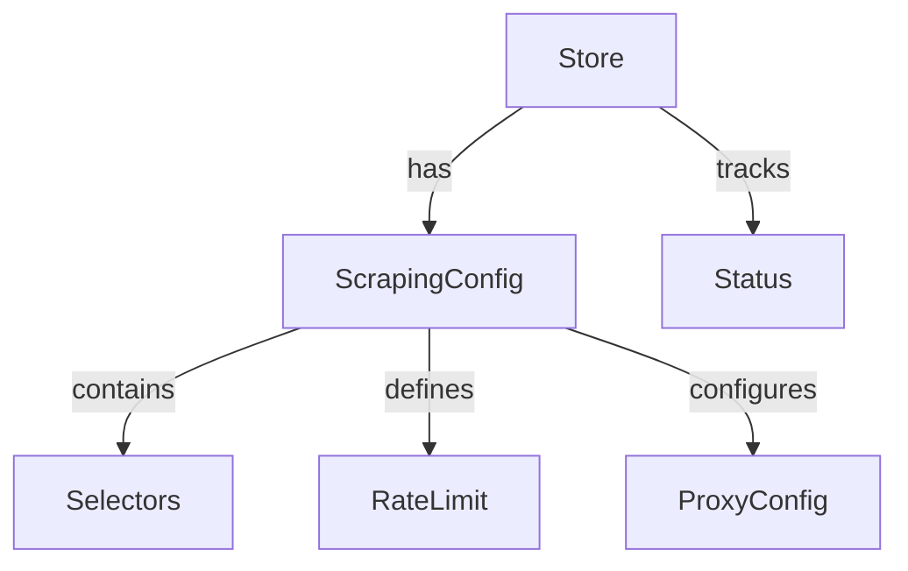

# 🧩 Domain Model

<div align="center">

*Domain model documentation for the Rust Web Scraper*

</div>

## 📑 Table of Contents

- [Overview](#overview)
- [Core Entities](#core-entities)
- [Value Objects](#value-objects)
- [Aggregates](#aggregates)
- [Domain Events](#domain-events)
- [Domain Services](#domain-services)

## Overview

The domain model represents the core business concepts and rules of the web scraping system. It is designed following Domain-Driven Design (DDD) principles to ensure a rich, expressive model that accurately captures the business requirements.

## Core Entities

### Product

The central entity representing a scraped product:

```rust
struct Product {
    id: ProductId,
    name: String,
    description: Option<String>,
    price: Price,
    store: Store,
    category: Category,
    metadata: ProductMetadata,
    created_at: DateTime<Utc>,
    updated_at: DateTime<Utc>,
}
```

### Store

Represents a retail store or marketplace:

```rust
struct Store {
    id: StoreId,
    name: String,
    url: Url,
    scraping_config: ScrapingConfig,
    status: StoreStatus,
}
```

### Category

Product categorization:

```rust
struct Category {
    id: CategoryId,
    name: String,
    parent: Option<Box<Category>>,
    level: u8,
}
```

## Value Objects

### Price

Immutable price representation:

```rust
struct Price {
    amount: Decimal,
    currency: Currency,
    original_amount: Option<Decimal>,
    discount_percentage: Option<f32>,
}
```

### ProductMetadata

Additional product information:

```rust
struct ProductMetadata {
    sku: Option<String>,
    brand: Option<String>,
    availability: StockStatus,
    ratings: Option<ProductRatings>,
    attributes: HashMap<String, String>,
}
```

### ScrapingConfig

Store-specific scraping configuration:

```rust
struct ScrapingConfig {
    selectors: SelectorMap,
    rate_limit: RateLimit,
    proxy_settings: ProxyConfig,
    retry_policy: RetryPolicy,
}
```

## Aggregates

### Product Aggregate



### Store Aggregate



## Domain Events

Events that capture important state changes:

### Product Events

```rust
enum ProductEvent {
    ProductCreated(Product),
    ProductUpdated {
        id: ProductId,
        changes: Vec<FieldChange>,
    },
    PriceChanged {
        product_id: ProductId,
        old_price: Price,
        new_price: Price,
    },
    ProductOutOfStock(ProductId),
    ProductBackInStock(ProductId),
}
```

### Store Events

```rust
enum StoreEvent {
    StoreAdded(Store),
    StoreConfigurationUpdated {
        store_id: StoreId,
        new_config: ScrapingConfig,
    },
    StoreScrapeStarted {
        store_id: StoreId,
        timestamp: DateTime<Utc>,
    },
    StoreScrapeCompleted {
        store_id: StoreId,
        stats: ScrapeStats,
    },
}
```

## Domain Services

Services that implement complex business logic:

### Product Service

```rust
trait ProductService {
    fn create_product(&self, data: ProductData) -> Result<Product>;
    fn update_product(&self, id: ProductId, changes: Vec<FieldChange>) -> Result<Product>;
    fn compare_prices(&self, product_id: ProductId, store_ids: Vec<StoreId>) -> Result<PriceComparison>;
    fn track_price_history(&self, product_id: ProductId) -> Result<Vec<PricePoint>>;
}
```

### Scraping Service

```rust
trait ScrapingService {
    fn schedule_scrape(&self, store_id: StoreId, config: ScrapeConfig) -> Result<JobId>;
    fn process_scrape_result(&self, result: ScrapeResult) -> Result<Vec<Product>>;
    fn validate_selectors(&self, selectors: SelectorMap) -> Result<ValidationReport>;
}
```

### Category Service

```rust
trait CategoryService {
    fn create_category(&self, data: CategoryData) -> Result<Category>;
    fn move_category(&self, id: CategoryId, new_parent: CategoryId) -> Result<Category>;
    fn get_category_tree(&self) -> Result<CategoryTree>;
}
```

## Domain Rules

Key business rules enforced by the domain model:

1. **Product Integrity**
   - Products must have a valid store and category
   - Prices must be non-negative
   - SKUs must be unique within a store

2. **Store Management**
   - Each store must have a valid scraping configuration
   - Rate limits must be respected
   - Store status must be tracked

3. **Category Organization**
   - Categories form a tree structure
   - Maximum category depth is enforced
   - Category names must be unique at each level

4. **Price Tracking**
   - Price changes are tracked historically
   - Discounts are calculated automatically
   - Price anomalies are detected

## Error Handling

Domain-specific error types:

```rust
enum DomainError {
    ValidationError(String),
    BusinessRuleViolation(String),
    ResourceNotFound(String),
    ConcurrencyError(String),
    ExternalServiceError(String),
}
```

## Validation Rules

### Product Validation

```rust
impl Product {
    fn validate(&self) -> Result<(), ValidationError> {
        // Name validation
        if self.name.is_empty() {
            return Err(ValidationError::EmptyName);
        }

        // Price validation
        if self.price.amount.is_negative() {
            return Err(ValidationError::InvalidPrice);
        }

        // Category validation
        if self.category.level > MAX_CATEGORY_DEPTH {
            return Err(ValidationError::CategoryTooDeep);
        }

        Ok(())
    }
}
``` 