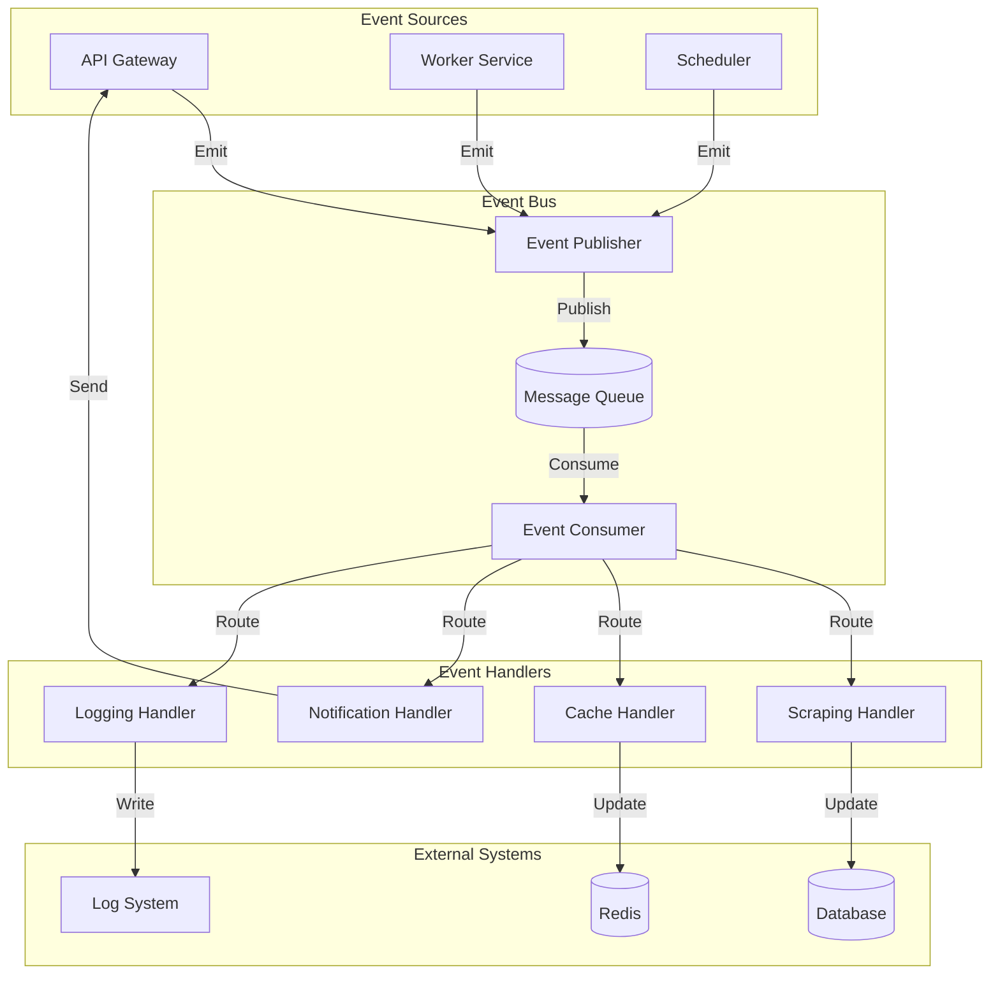
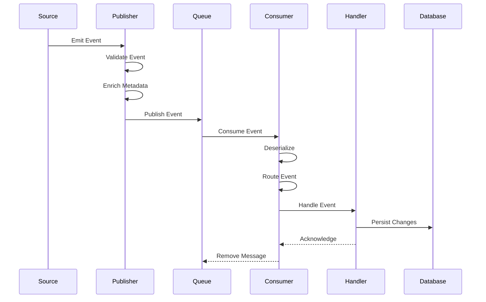

# 🔄 Event System

<div align="center">

*Event System documentation for the Rust Web Scraper*

</div>

## 📑 Table of Contents

- [Overview](#overview)
- [Event Types](#event-types)
- [Event Bus](#event-bus)
- [Event Handlers](#event-handlers)
- [Implementation Details](#implementation-details)

## Overview

The event system is a core component of the Rust Web Scraper, enabling loose coupling between components and asynchronous processing of operations. It follows an event-driven architecture pattern to handle complex workflows and maintain system state.

## Architecture Diagram



## Event Types

### Domain Events

Core business events that represent significant state changes:

```rust
#[derive(Debug, Clone, Serialize, Deserialize)]
enum DomainEvent {
    // Scraping Events
    ScrapeRequested {
        store_id: StoreId,
        config: ScrapingConfig,
        timestamp: DateTime<Utc>,
    },
    ScrapeCompleted {
        store_id: StoreId,
        stats: ScrapeStats,
        timestamp: DateTime<Utc>,
    },
    ScrapeFailed {
        store_id: StoreId,
        error: ScrapeError,
        timestamp: DateTime<Utc>,
    },

    // Product Events
    ProductCreated(Product),
    ProductUpdated {
        id: ProductId,
        changes: Vec<FieldChange>,
    },
    ProductDeleted(ProductId),

    // Cache Events
    CacheUpdated {
        key: String,
        timestamp: DateTime<Utc>,
    },
    CacheInvalidated {
        pattern: String,
        timestamp: DateTime<Utc>,
    },
}
```

### System Events

Internal events for system operations and monitoring:

```rust
#[derive(Debug, Clone, Serialize, Deserialize)]
enum SystemEvent {
    // Service Events
    ServiceStarted {
        service_id: String,
        config: ServiceConfig,
    },
    ServiceStopped {
        service_id: String,
        reason: StopReason,
    },

    // Monitoring Events
    HealthCheckFailed {
        service: String,
        error: String,
    },
    ResourceThresholdExceeded {
        resource: String,
        current: f64,
        threshold: f64,
    },

    // Error Events
    ErrorOccurred {
        error_type: ErrorType,
        message: String,
        context: HashMap<String, String>,
    },
}
```

## Event Bus

The event bus manages event publication and consumption:

```rust
trait EventBus: Send + Sync {
    async fn publish<E: Event>(&self, event: E) -> Result<(), Error>;
    async fn subscribe<E: Event>(&self, handler: Box<dyn EventHandler<E>>) -> Result<(), Error>;
    async fn unsubscribe<E: Event>(&self, handler_id: HandlerId) -> Result<(), Error>;
}

struct RabbitMQEventBus {
    connection: Connection,
    channel: Channel,
    handlers: Arc<RwLock<HashMap<TypeId, Vec<Box<dyn EventHandler<Event>>>>>>,
}

impl EventBus for RabbitMQEventBus {
    async fn publish<E: Event>(&self, event: E) -> Result<(), Error> {
        let payload = serde_json::to_vec(&event)?;
        self.channel
            .basic_publish(
                "",
                &event.routing_key(),
                BasicPublishOptions::default(),
                payload,
                BasicProperties::default(),
            )
            .await?;
        Ok(())
    }
}
```

## Event Handlers

Handlers process specific event types:

```rust
#[async_trait]
trait EventHandler<E: Event>: Send + Sync {
    fn id(&self) -> HandlerId;
    async fn handle(&self, event: E) -> Result<(), Error>;
}

struct ProductEventHandler {
    id: HandlerId,
    repository: Arc<dyn Repository>,
    cache: Arc<dyn Cache>,
}

#[async_trait]
impl EventHandler<ProductEvent> for ProductEventHandler {
    fn id(&self) -> HandlerId {
        self.id
    }

    async fn handle(&self, event: ProductEvent) -> Result<(), Error> {
        match event {
            ProductEvent::Created(product) => {
                self.repository.save(product.clone()).await?;
                self.cache.invalidate_product(product.id).await?;
            }
            ProductEvent::Updated { id, changes } => {
                self.repository.update(id, changes).await?;
                self.cache.invalidate_product(id).await?;
            }
            ProductEvent::Deleted(id) => {
                self.repository.delete(id).await?;
                self.cache.invalidate_product(id).await?;
            }
        }
        Ok(())
    }
}
```

## Implementation Details

### Event Configuration

Event routing and handling configuration:

```rust
struct EventConfig {
    exchange: String,
    queue: String,
    routing_key: String,
    handler: Box<dyn EventHandler<Event>>,
    retry_policy: RetryPolicy,
}

struct RetryPolicy {
    max_retries: u32,
    backoff: Duration,
    max_backoff: Duration,
}
```

### Event Processing Pipeline



### Error Handling

Strategies for handling event processing failures:

```rust
enum EventError {
    ValidationError(String),
    PublishError(String),
    ConsumeError(String),
    HandlerError(String),
    RetryExhausted {
        event: Box<dyn Event>,
        attempts: u32,
        last_error: String,
    },
}

struct ErrorHandler {
    dead_letter_queue: String,
    notification_service: Arc<dyn NotificationService>,
    logger: Arc<dyn Logger>,
}

impl ErrorHandler {
    async fn handle_error(&self, error: EventError, event: Box<dyn Event>) -> Result<(), Error> {
        match error {
            EventError::RetryExhausted { .. } => {
                self.move_to_dead_letter_queue(event).await?;
                self.notify_admin(error).await?;
            }
            _ => {
                self.logger.error(error).await?;
                self.retry_event(event).await?;
            }
        }
        Ok(())
    }
}
```

### Monitoring and Metrics

Event system monitoring capabilities:

```rust
struct EventMetrics {
    published_total: Counter,
    consumed_total: Counter,
    processing_duration: Histogram,
    error_total: Counter,
    retry_total: Counter,
}

impl EventMetrics {
    fn record_publish(&self) {
        self.published_total.inc();
    }

    fn record_consume(&self) {
        self.consumed_total.inc();
    }

    fn record_processing_time(&self, duration: Duration) {
        self.processing_duration.observe(duration.as_secs_f64());
    }

    fn record_error(&self, error_type: &str) {
        self.error_total.with_label_values(&[error_type]).inc();
    }
}
``` 