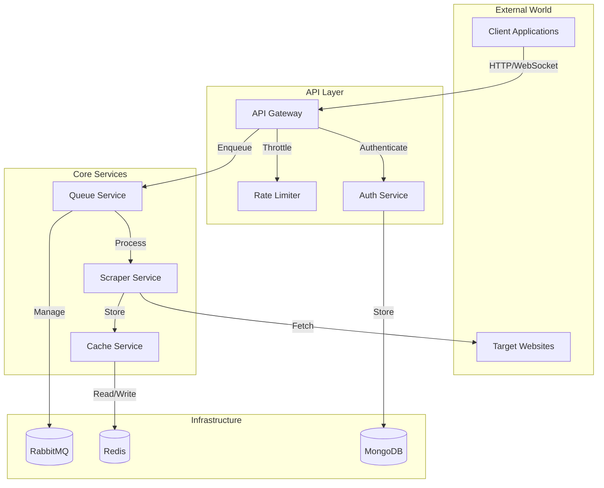
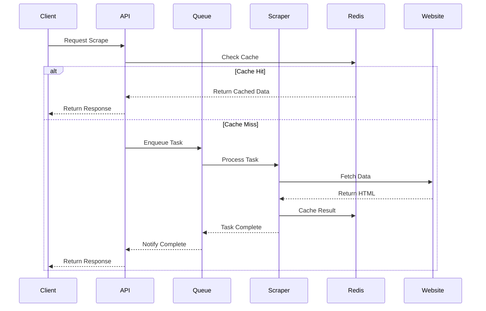
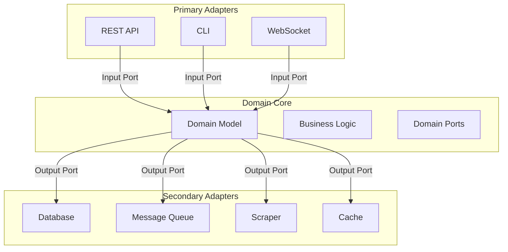
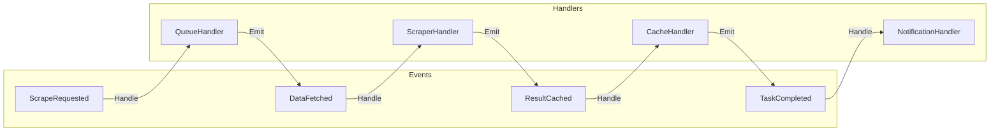

# 🏗️ Architecture Overview

<div align="center">

*System architecture documentation for the Rust Web Scraper*

</div>

## 📑 Table of Contents

<details open>
<summary><strong>Core Architecture</strong></summary>

- [Overview](#overview)
- [System Components](#system-components)
- [Data Flow](#data-flow)
- [Technology Stack](#technology-stack)
</details>

<details open>
<summary><strong>Design Patterns</strong></summary>

- [Hexagonal Architecture](#hexagonal-architecture)
- [Event-Driven Design](#event-driven-design)
- [CQRS Pattern](#cqrs-pattern)
</details>

<details open>
<summary><strong>Infrastructure</strong></summary>

- [Deployment Model](#deployment-model)
- [Scalability](#scalability)
- [High Availability](#high-availability)
</details>

## Overview

The Rust Web Scraper is built using a hexagonal architecture (ports and adapters) pattern, emphasizing separation of concerns and domain-driven design. The system is designed to be scalable, maintainable, and resilient.

### Key Architectural Principles

1. **Domain-Centric Design**
   - Clear domain boundaries
   - Rich domain model
   - Business logic isolation
   - Domain events

2. **Clean Architecture**
   - Dependency inversion
   - Clear interfaces
   - Pluggable components
   - Testable design

3. **Event-Driven**
   - Asynchronous processing
   - Message-based communication
   - Event sourcing
   - Eventual consistency

## System Components



## Data Flow

### Scraping Flow



## Technology Stack

### Core Technologies

1. **Backend Services**
   - Rust (Actix-web framework)
   - WebAssembly (for JS execution)
   - Tokio (async runtime)
   - Serde (serialization)

2. **Data Storage**
   - MongoDB (user data)
   - Redis (caching)
   - RabbitMQ (queuing)

3. **Infrastructure**
   - Docker
   - Kubernetes
   - Terraform
   - Prometheus/Grafana

## Hexagonal Architecture

Our implementation follows the hexagonal architecture pattern:



## Event-Driven Design

### Event Flow



## Deployment Model

### Production Environment

```mermaid
graph TB
    subgraph "Load Balancer"
        LB[HAProxy]
    end

    subgraph "API Cluster"
        API1[API Node 1]
        API2[API Node 2]
        API3[API Node N]
    end

    subgraph "Worker Cluster"
        W1[Worker 1]
        W2[Worker 2]
        W3[Worker N]
    end

    subgraph "Data Layer"
        M1[(MongoDB Primary)]
        M2[(MongoDB Secondary)]
        R1[(Redis Master)]
        R2[(Redis Replica)]
        Q1[(RabbitMQ Node 1)]
        Q2[(RabbitMQ Node 2)]
    end

    LB -->|Route| API1
    LB -->|Route| API2
    LB -->|Route| API3
    API1 -->|Use| Data Layer
    API2 -->|Use| Data Layer
    API3 -->|Use| Data Layer
    W1 -->|Use| Data Layer
    W2 -->|Use| Data Layer
    W3 -->|Use| Data Layer
```

## Scalability

### Scaling Strategies

1. **Horizontal Scaling**
   - API nodes auto-scaling
   - Worker pool expansion
   - Database replication
   - Queue clustering

2. **Performance Optimization**
   - Caching layers
   - Connection pooling
   - Load balancing
   - Request batching

3. **Resource Management**
   - Container orchestration
   - Resource quotas
   - Auto-scaling policies
   - Load shedding

## High Availability

### Reliability Measures

1. **Fault Tolerance**
   - Service redundancy
   - Data replication
   - Circuit breakers
   - Fallback mechanisms

2. **Monitoring**
   - Health checks
   - Performance metrics
   - Error tracking
   - Resource utilization

3. **Recovery**
   - Automatic failover
   - Data backups
   - State recovery
   - Transaction logs 