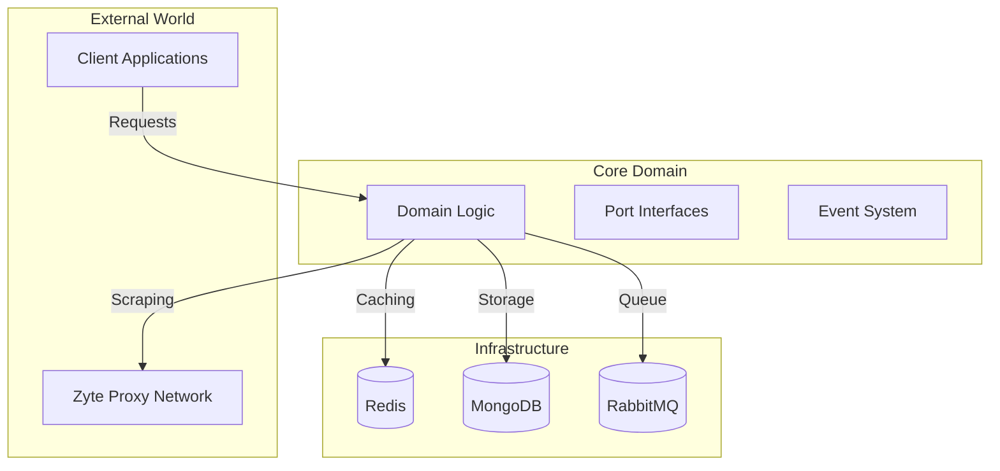

# 🏗️ Architecture Overview

## Introduction

The Rust Web Scraper is built following the Hexagonal Architecture (Ports and Adapters) pattern, emphasizing clean separation of concerns and domain-driven design principles.

## System Components

## Key Architectural Principles

1. **Domain-Centric Design**
   - Core business logic isolated from external concerns
   - Rich domain model with clear boundaries
   - Business rules independent of infrastructure

2. **Ports and Adapters**
   - Clear interface definitions (ports)
   - Pluggable implementations (adapters)
   - Easy testing and component replacement

3. **Event-Driven Architecture**
   - Asynchronous processing
   - Loose coupling between components
   - Scalable message processing

## Layer Details

### Domain Layer
- Business entities and value objects
- Use case implementations
- Domain events and handlers
- Port interfaces

### Application Layer
- Use case orchestration
- Transaction management
- Event publishing
- External service coordination

### Infrastructure Layer
- Database implementations
- Caching mechanisms
- Message queue integration
- External API clients

## Communication Flow

1. **Inbound Flow**
   - HTTP requests through API endpoints
   - Task queue processing
   - Event handling

2. **Outbound Flow**
   - Web scraping operations
   - Data persistence
   - Cache management
   - Event publishing

## Design Decisions

### Why Hexagonal Architecture?
- Clear separation of concerns
- Testability and maintainability
- Infrastructure independence
- Flexible deployment options

### Why Event-Driven?
- Scalable processing
- Loose coupling
- Reliable task handling
- Easy monitoring

## Further Reading

- [Domain Model](domain-model.md)
- [Ports and Adapters](ports-and-adapters.md)
- [Event System](event-system.md) 