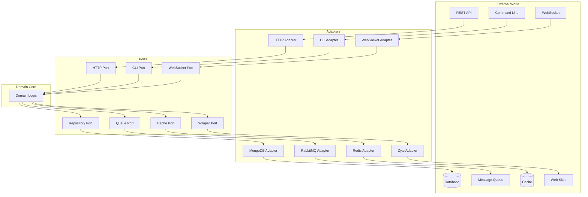

# 🔌 Ports and Adapters

<div align="center">

*Ports and Adapters (Hexagonal Architecture) documentation for the Rust Web Scraper*

</div>

## 📑 Table of Contents

- [Overview](#overview)
- [Ports](#ports)
  - [Primary Ports](#primary-ports)
  - [Secondary Ports](#secondary-ports)
- [Adapters](#adapters)
  - [Primary Adapters](#primary-adapters)
  - [Secondary Adapters](#secondary-adapters)
- [Implementation Details](#implementation-details)

## Overview

The Rust Web Scraper follows the Ports and Adapters (Hexagonal) architectural pattern, which isolates the core domain from external concerns. This architecture enables:

- Clean separation of concerns
- Easy testing through adapter substitution
- Flexible infrastructure choices
- Independent evolution of components

## Architecture Diagram



## Ports

### Primary Ports (Driving Ports)

Interfaces that the application exposes to the outside world:

#### HTTP Port

```rust
trait HttpPort {
    async fn handle_request(&self, request: HttpRequest) -> Result<HttpResponse, Error>;
    async fn health_check(&self) -> Result<HealthStatus, Error>;
}
```

#### CLI Port

```rust
trait CliPort {
    async fn execute_command(&self, command: CliCommand) -> Result<CommandOutput, Error>;
    fn get_available_commands(&self) -> Vec<CommandInfo>;
}
```

#### WebSocket Port

```rust
trait WebSocketPort {
    async fn handle_connection(&self, connection: WebSocketConnection) -> Result<(), Error>;
    async fn broadcast_event(&self, event: DomainEvent) -> Result<(), Error>;
}
```

### Secondary Ports (Driven Ports)

Interfaces that the application core requires to interact with external systems:

#### Repository Port

```rust
trait RepositoryPort<T> {
    async fn save(&self, entity: T) -> Result<T, Error>;
    async fn find_by_id(&self, id: Id) -> Result<Option<T>, Error>;
    async fn delete(&self, id: Id) -> Result<(), Error>;
    async fn find_all(&self, filter: Filter) -> Result<Vec<T>, Error>;
}
```

#### Queue Port

```rust
trait QueuePort {
    async fn publish(&self, message: Message) -> Result<(), Error>;
    async fn consume(&self, queue: String) -> Result<MessageStream, Error>;
    async fn ack(&self, message: Message) -> Result<(), Error>;
}
```

#### Cache Port

```rust
trait CachePort {
    async fn get(&self, key: String) -> Result<Option<Value>, Error>;
    async fn set(&self, key: String, value: Value, ttl: Duration) -> Result<(), Error>;
    async fn delete(&self, key: String) -> Result<(), Error>;
    async fn clear(&self) -> Result<(), Error>;
}
```

#### Scraper Port

```rust
trait ScraperPort {
    async fn scrape(&self, url: Url, config: ScraperConfig) -> Result<ScrapedData, Error>;
    async fn validate_selectors(&self, selectors: Selectors) -> Result<ValidationReport, Error>;
}
```

## Adapters

### Primary Adapters (Driving Adapters)

Implementations that drive the application through its primary ports:

#### HTTP Adapter (Actix-Web)

```rust
struct ActixWebAdapter {
    http_port: Arc<dyn HttpPort>,
}

impl ActixWebAdapter {
    async fn handle_product_request(&self, req: HttpRequest) -> impl Responder {
        let domain_request = self.convert_request(req);
        let result = self.http_port.handle_request(domain_request).await;
        self.convert_response(result)
    }
}
```

#### CLI Adapter (Clap)

```rust
struct ClapAdapter {
    cli_port: Arc<dyn CliPort>,
}

impl ClapAdapter {
    fn execute(&self, args: Vec<String>) -> Result<(), Error> {
        let command = self.parse_args(args);
        self.cli_port.execute_command(command)
    }
}
```

### Secondary Adapters (Driven Adapters)

Implementations that connect the application to external services:

#### MongoDB Adapter

```rust
struct MongoDbAdapter {
    client: mongodb::Client,
}

impl RepositoryPort<Product> for MongoDbAdapter {
    async fn save(&self, product: Product) -> Result<Product, Error> {
        let doc = self.to_document(&product);
        self.client.save(doc).await?;
        Ok(product)
    }
}
```

#### RabbitMQ Adapter

```rust
struct RabbitMqAdapter {
    connection: lapin::Connection,
}

impl QueuePort for RabbitMqAdapter {
    async fn publish(&self, message: Message) -> Result<(), Error> {
        let channel = self.connection.create_channel().await?;
        channel.basic_publish(
            message.exchange,
            message.routing_key,
            message.payload,
        ).await?;
        Ok(())
    }
}
```

#### Redis Adapter

```rust
struct RedisAdapter {
    client: redis::Client,
}

impl CachePort for RedisAdapter {
    async fn get(&self, key: String) -> Result<Option<Value>, Error> {
        let mut conn = self.client.get_async_connection().await?;
        conn.get(key).await.map_err(Error::from)
    }
}
```

## Implementation Details

### Dependency Injection

The application uses dependency injection to wire up ports and adapters:

```rust
struct Application {
    http_adapter: ActixWebAdapter,
    repository_adapter: MongoDbAdapter,
    queue_adapter: RabbitMqAdapter,
    cache_adapter: RedisAdapter,
}

impl Application {
    fn new(config: Config) -> Result<Self, Error> {
        let repository = MongoDbAdapter::new(config.mongodb_url);
        let queue = RabbitMqAdapter::new(config.rabbitmq_url);
        let cache = RedisAdapter::new(config.redis_url);
        
        let domain_service = DomainService::new(repository, queue, cache);
        let http_port = HttpPortImpl::new(domain_service);
        let http_adapter = ActixWebAdapter::new(http_port);
        
        Ok(Self {
            http_adapter,
            repository_adapter: repository,
            queue_adapter: queue,
            cache_adapter: cache,
        })
    }
}
```

### Error Handling

Each port defines its own error types that are mapped by adapters:

```rust
enum PortError {
    NotFound,
    ValidationFailed(String),
    Unauthorized,
    InternalError(String),
}

enum AdapterError {
    ConnectionFailed(String),
    Timeout,
    InvalidData(String),
}

impl From<AdapterError> for PortError {
    fn from(error: AdapterError) -> Self {
        match error {
            AdapterError::ConnectionFailed(msg) => PortError::InternalError(msg),
            AdapterError::Timeout => PortError::InternalError("Timeout".to_string()),
            AdapterError::InvalidData(msg) => PortError::ValidationFailed(msg),
        }
    }
}
```

### Testing

The architecture facilitates testing through mock adapters:

```rust
struct MockRepositoryAdapter {
    products: Arc<RwLock<HashMap<String, Product>>>,
}

impl RepositoryPort<Product> for MockRepositoryAdapter {
    async fn save(&self, product: Product) -> Result<Product, Error> {
        let mut products = self.products.write().await;
        products.insert(product.id.clone(), product.clone());
        Ok(product)
    }
}

#[cfg(test)]
mod tests {
    #[tokio::test]
    async fn test_product_creation() {
        let repository = MockRepositoryAdapter::new();
        let service = ProductService::new(repository);
        
        let result = service.create_product(product_data).await;
        assert!(result.is_ok());
    }
}
```