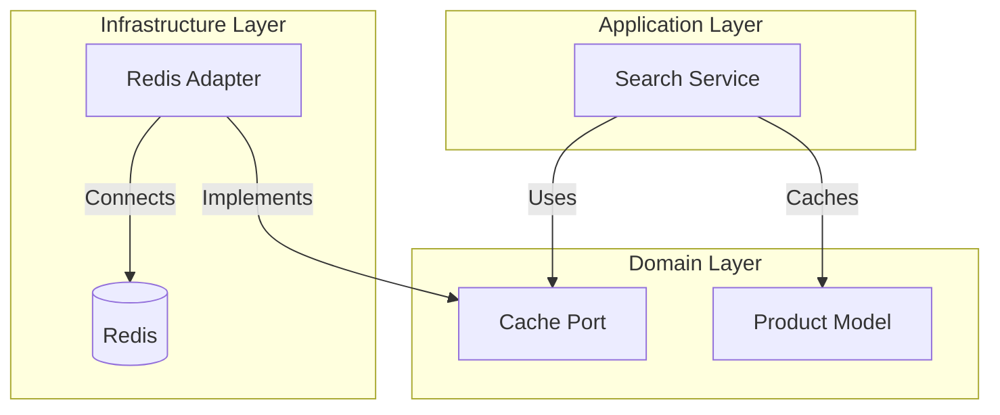
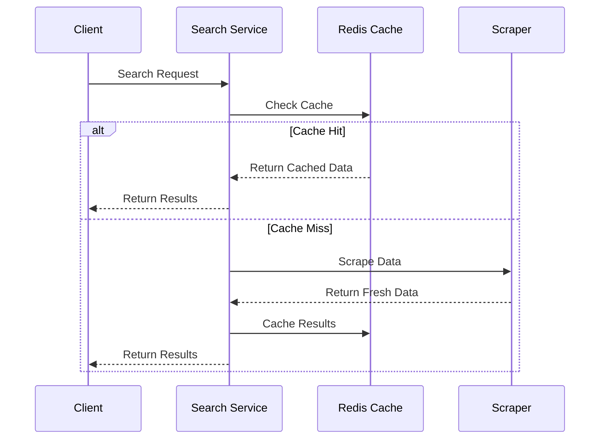
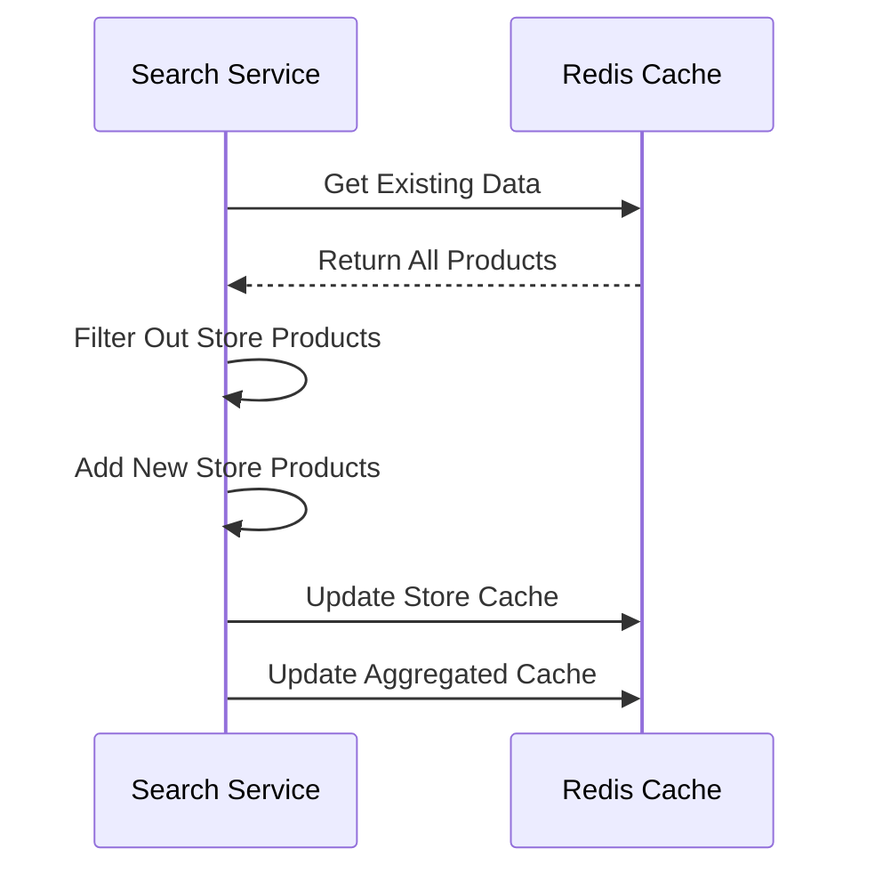

# 🔄 Caching System

## Overview

The caching system is implemented using Redis and follows the Ports and Adapters pattern. It provides efficient caching for product search results, both for individual stores and aggregated results.

## Architecture



## Key Features

- **Dual-Layer Caching**: Stores both per-store and aggregated results
- **TTL Management**: 5-minute default expiration for search results
- **Atomic Operations**: Safe concurrent updates for store-specific and aggregated caches
- **Error Handling**: Comprehensive error handling with domain-specific errors
- **Connection Management**: Efficient connection pooling with Redis

## Cache Structure

### Key Format
- Store-specific results: `products:{query}:{store}`
- Aggregated results: `products:{query}:all`

### Data Organization
```json
{
    "products:hammer:bricodepot": "[{product1}, {product2}]",
    "products:hammer:bauhaus": "[{product3}, {product4}]",
    "products:hammer:all": "[{product1}, {product2}, {product3}, {product4}]"
}
```

## Implementation Details

### Connection Management
```rust
pub async fn new(config: Box<dyn CacheConfig>) -> Result<Self, DomainError> {
    // Connection setup with authentication and health check
    // Returns a connection manager for efficient connection handling
}
```

### Core Operations

1. **Reading Cache**
   ```rust
   async fn get_products(&self, query: &str) -> Result<Vec<Product>, DomainError>
   async fn get_store_products(&self, query: &str, store: &Store) -> Result<Vec<Product>, DomainError>
   ```

2. **Writing Cache**
   ```rust
   async fn cache_products(&self, query: &str, products: &[Product]) -> Result<(), DomainError>
   async fn cache_store_products(&self, query: &str, store: &Store, products: &[Product]) -> Result<(), DomainError>
   ```

3. **Generic Operations**
   ```rust
   async fn set_value(&self, key: &str, value: &str, ttl_secs: Option<u64>) -> Result<(), DomainError>
   async fn get_value(&self, key: &str) -> Result<Option<String>, DomainError>
   ```

## Cache Flow

1. **Search Request Flow**


2. **Store-Specific Update Flow**


## Error Handling

The caching system uses domain-specific error types:
```rust
DomainError::cache(format!("Failed to cache products in Redis: {}", e))
```

Common error scenarios:
- Connection failures
- Authentication errors
- Serialization/deserialization errors
- Redis operation timeouts

## Configuration

The cache is configured through the `CacheConfig` trait:
```rust
pub trait CacheConfig {
    fn connection_url(&self) -> String;
    // Additional configuration methods
}
```

Key configuration parameters:
- Redis connection URL
- Connection pool size
- Default TTL values
- Retry policies

## Monitoring

The caching system includes:
- Debug logging for connection details
- Info logging for operation status
- Error logging for failures
- Metrics for cache hits/misses

## Best Practices

1. **Cache Invalidation**
   - Use store-specific invalidation
   - Maintain consistency between store and aggregated caches
   - Implement TTL for automatic cleanup

2. **Error Handling**
   - Graceful degradation on cache failures
   - Fallback to direct scraping
   - Comprehensive error logging

3. **Performance**
   - Use connection pooling
   - Implement batch operations
   - Monitor cache hit rates

## Integration Example

```rust
// Initialize cache
let cache = RedisAdapter::new(config).await?;

// Check cache before scraping
if let Ok(products) = cache.get_products(query).await {
    if !products.is_empty() {
        return Ok(products);
    }
}

// Cache new results
cache.cache_products(query, &products).await?;
``` 