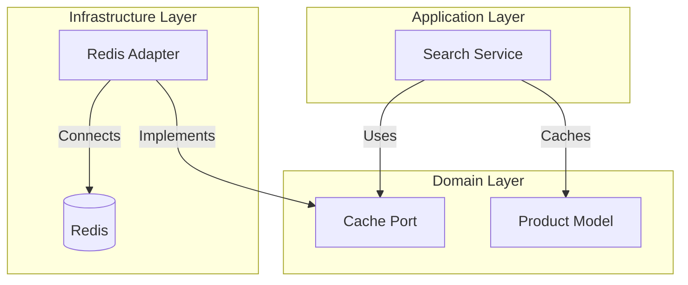
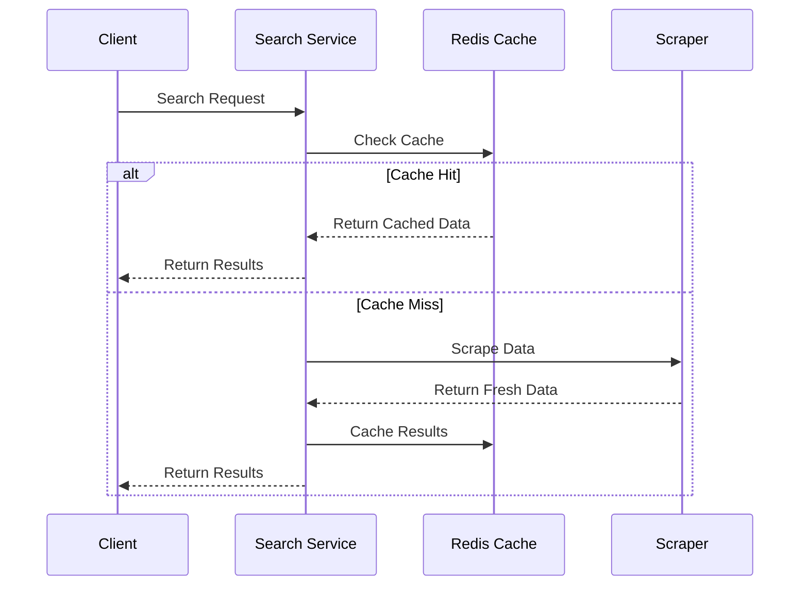
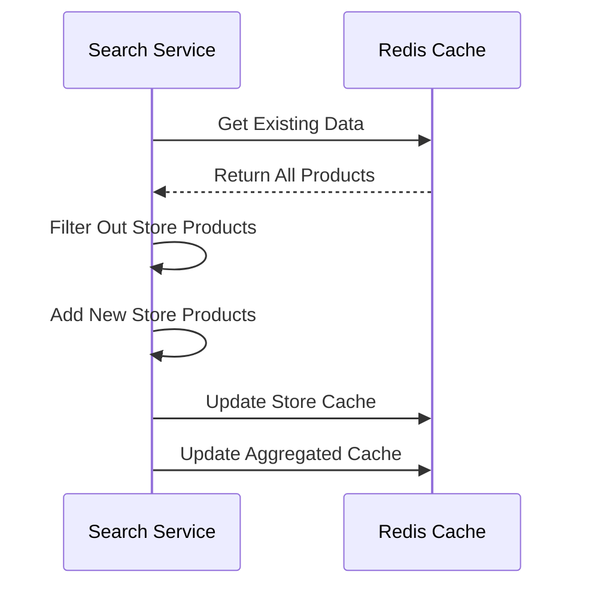

# 🔄 Redis Caching System

<div align="center">

*High-performance caching layer with Redis for the Rust Web Scraper*

[Architecture](#architecture) •
[Implementation](#implementation-details) •
[Configuration](#configuration) •
[Testing](../testing/cache-testing.md)

</div>

## 📑 Table of Contents

<details open>
<summary><strong>Overview & Architecture</strong></summary>

- [Overview](#overview)
- [Architecture](#architecture)
- [Key Features](#key-features)
- [Cache Structure](#cache-structure)
</details>

<details open>
<summary><strong>Implementation</strong></summary>

- [Implementation Details](#implementation-details)
  - [Connection Management](#connection-management)
  - [Core Operations](#core-operations)
- [Cache Flow](#cache-flow)
  - [Search Request Flow](#1-search-request-flow)
  - [Store-Specific Update Flow](#2-store-specific-update-flow)
</details>

<details open>
<summary><strong>Configuration & Operations</strong></summary>

- [Configuration](#configuration)
- [Error Handling](#error-handling)
- [Monitoring](#monitoring)
- [Best Practices](#best-practices)
</details>

<details open>
<summary><strong>Infrastructure & Extensions</strong></summary>

- [Docker Configuration](#-docker-configuration)
- [Extending the Cache](#-extending-the-cache)
- [Performance Considerations](#-performance-considerations)
- [Security Considerations](#-security-considerations)
</details>

<details open>
<summary><strong>Future Development</strong></summary>

- [Future Improvements](#-future-improvements)
  - [High Priority](#high-priority)
  - [Performance Optimizations](#performance-optimizations)
  - [Monitoring & Observability](#monitoring--observability)
</details>

---

## Overview

The Redis caching system is a critical component of our web scraping infrastructure, providing high-performance data caching with configurable TTL, concurrent access support, and robust error handling. The system follows the Hexagonal Architecture pattern, ensuring clean separation of concerns and maintainable code.

> 📘 **Testing Documentation**
>
> For detailed information about testing strategies, test implementation, and best practices, please refer to our comprehensive [Cache Testing Guide](../testing/cache-testing.md).

## Architecture



## Key Features

- **Dual-Layer Caching**: Stores both per-store and aggregated results
- **TTL Management**: 5-minute default expiration for search results
- **Atomic Operations**: Safe concurrent updates for store-specific and aggregated caches
- **Error Handling**: Comprehensive error handling with domain-specific errors
- **Connection Management**: Efficient connection pooling with Redis

## Cache Structure

### Key Format
- Store-specific results: `products:{query}:{store}`
- Aggregated results: `products:{query}:all`

### Data Organization
```json
{
    "products:hammer:bricodepot": "[{product1}, {product2}]",
    "products:hammer:bauhaus": "[{product3}, {product4}]",
    "products:hammer:all": "[{product1}, {product2}, {product3}, {product4}]"
}
```

## Implementation Details

### Connection Management
```rust
pub async fn new(config: Box<dyn CacheConfig>) -> Result<Self, DomainError> {
    // Connection setup with authentication and health check
    // Returns a connection manager for efficient connection handling
}
```

### Core Operations

1. **Reading Cache**
   ```rust
   async fn get_products(&self, query: &str) -> Result<Vec<Product>, DomainError>
   async fn get_store_products(&self, query: &str, store: &Store) -> Result<Vec<Product>, DomainError>
   ```

2. **Writing Cache**
   ```rust
   async fn cache_products(&self, query: &str, products: &[Product]) -> Result<(), DomainError>
   async fn cache_store_products(&self, query: &str, store: &Store, products: &[Product]) -> Result<(), DomainError>
   ```

3. **Generic Operations**
   ```rust
   async fn set_value(&self, key: &str, value: &str, ttl_secs: Option<u64>) -> Result<(), DomainError>
   async fn get_value(&self, key: &str) -> Result<Option<String>, DomainError>
   ```

## Cache Flow

1. **Search Request Flow**


2. **Store-Specific Update Flow**


## Error Handling

The caching system uses domain-specific error types:
```rust
DomainError::cache(format!("Failed to cache products in Redis: {}", e))
```

Common error scenarios:
- Connection failures
- Authentication errors
- Serialization/deserialization errors
- Redis operation timeouts

## Configuration

The cache is configured through the `CacheConfig` trait:
```rust
pub trait CacheConfig {
    fn connection_url(&self) -> String;
    // Additional configuration methods
}
```

Key configuration parameters:
- Redis connection URL
- Connection pool size
- Default TTL values
- Retry policies

## Monitoring

The caching system includes:
- Debug logging for connection details
- Info logging for operation status
- Error logging for failures
- Metrics for cache hits/misses

## Best Practices

1. **Cache Invalidation**
   - Use store-specific invalidation
   - Maintain consistency between store and aggregated caches
   - Implement TTL for automatic cleanup

2. **Error Handling**
   - Graceful degradation on cache failures
   - Fallback to direct scraping
   - Comprehensive error logging

3. **Performance**
   - Use connection pooling
   - Implement batch operations
   - Monitor cache hit rates

## Integration Example

```rust
// Initialize cache
let cache = RedisAdapter::new(config).await?;

// Check cache before scraping
if let Ok(products) = cache.get_products(query).await {
    if !products.is_empty() {
        return Ok(products);
    }
}

// Cache new results
cache.cache_products(query, &products).await?;
```

## 🐳 Docker Configuration

The Redis instance is running in a Docker container with the following configuration:

```yaml
redis:
  image: redis:7.2-alpine
  container_name: rust_scraper_redis
  command: redis-server --requirepass ${REDIS_PASSWORD}
  ports:
    - "6379:6379"
  volumes:
    - redis_data:/data
    - ./docker/redis/redis.conf:/usr/local/etc/redis/redis.conf:ro
  environment:
    - REDIS_PASSWORD=${REDIS_PASSWORD}
```

### Redis Configuration
The Redis configuration (`redis.conf`) includes:
- Memory limits
- Persistence settings
- Connection settings
- Security policies

## 🔄 Extending the Cache

### Adding New Fields to Cache

1. **Update Domain Models**
   ```rust
   // 1. Add new field to Product struct
   pub struct Product {
       // ... existing fields ...
       pub new_field: String,
   }
   ```

2. **Update Serialization**
   ```rust
   // 2. Update serde derivation if needed
   #[derive(Serialize, Deserialize)]
   pub struct Product {
       #[serde(rename = "new_field")]
       pub new_field: String,
   }
   ```

3. **Cache Migration Strategy**
   ```rust
   impl RedisAdapter {
       // 3. Add migration function for existing cache data
       async fn migrate_cache_data(&self) -> Result<(), DomainError> {
           let mut conn = self.client.clone();
           
           // Get all cache keys matching the pattern
           let keys: Vec<String> = conn.keys("products:*").await?;
           
           for key in keys {
               // Read existing data
               let data: Option<String> = conn.get(&key).await?;
               if let Some(json) = data {
                   // Deserialize with old structure
                   let old_products: Vec<OldProduct> = serde_json::from_str(&json)?;
                   
                   // Transform to new structure
                   let new_products: Vec<Product> = old_products
                       .into_iter()
                       .map(|p| Product {
                           new_field: String::new(), // Set default value
                           ..p.into()
                       })
                       .collect();
                   
                   // Write back with new structure
                   let new_json = serde_json::to_string(&new_products)?;
                   conn.set_ex(&key, new_json, 300).await?;
               }
           }
           Ok(())
       }
   }
   ```

4. **Update Cache Operations**
   ```rust
   impl RedisAdapter {
       // 4. Update cache methods to handle new fields
       async fn cache_products(&self, query: &str, products: &[Product]) -> Result<(), DomainError> {
           // Existing implementation remains the same
           // New fields will be automatically included in serialization
       }

       async fn get_products(&self, query: &str) -> Result<Vec<Product>, DomainError> {
           // Existing implementation remains the same
           // New fields will be automatically deserialized
       }
   }
   ```

5. **Version Management**
   ```rust
   // 5. Add version tracking to cache entries
   #[derive(Serialize, Deserialize)]
   struct CacheEntry<T> {
       version: u32,
       data: T,
       created_at: DateTime<Utc>,
   }

   impl RedisAdapter {
       async fn cache_with_version<T: Serialize>(&self, key: &str, data: T) -> Result<(), DomainError> {
           let entry = CacheEntry {
               version: CACHE_VERSION,
               data,
               created_at: Utc::now(),
           };
           // ... cache the versioned entry
       }
   }
   ```

6. **Deployment Steps**
   ```bash
   # 6. Deployment checklist for cache field updates
   
   # 1. Deploy new code with backward compatibility
   cargo build --release
   
   # 2. Run cache migration
   cargo run --bin cache_migration
   
   # 3. Verify migration success
   cargo run --bin verify_cache
   
   # 4. Clean up old cache entries (optional)
   cargo run --bin cleanup_cache
   ```

7. **Testing New Fields**
   ```rust
   #[tokio::test]
   async fn test_cache_with_new_fields() {
       let adapter = setup_test_cache().await;
       
       // Test with new fields
       let product = Product {
           new_field: "test".to_string(),
           // ... other fields
       };
       
       // Verify cache operations
       adapter.cache_products("test", &[product.clone()]).await?;
       let cached = adapter.get_products("test").await?;
       assert_eq!(cached[0].new_field, product.new_field);
   }
   ```

### Best Practices for Adding Fields

1. **Backward Compatibility**
   - Always add optional fields first
   - Provide default values
   - Keep old field readers for a transition period

2. **Data Migration**
   - Plan migration strategy
   - Run migrations during low-traffic periods
   - Have rollback plan ready

3. **Versioning**
   - Track cache entry versions
   - Handle multiple versions during transition
   - Clean up old versions after migration

4. **Monitoring**
   - Monitor migration progress
   - Track errors during migration
   - Measure performance impact

### Adding New Cache Types

1. **Define New Port Methods**
   ```rust
   #[async_trait]
   pub trait CachePort {
       // ... existing methods ...
       
       async fn cache_new_type(&self, key: &str, data: &NewType) 
           -> Result<(), DomainError>;
   }
   ```

2. **Implement in Redis Adapter**
   ```rust
   impl RedisAdapter {
       fn get_new_type_key(&self, identifier: &str) -> String {
           format!("new_type:{}", identifier)
       }
   }
   ```

## 🚀 Future Improvements

### High Priority
- [ ] Implement cache warming strategy
- [ ] Add cache statistics collection
- [ ] Implement batch operations for better performance
- [ ] Add circuit breaker for Redis operations

### Performance Optimizations
- [ ] Implement Redis pipelining for bulk operations
- [ ] Add compression for large cached objects
- [ ] Optimize TTL values based on data access patterns
- [ ] Implement cache preloading for common searches

### Monitoring & Observability
- [ ] Add detailed metrics for cache operations
- [ ] Implement cache hit/miss ratio tracking
- [ ] Add Redis memory usage monitoring
- [ ] Create dashboards for cache performance

### Reliability & Recovery
- [ ] Implement automatic cache rebuild
- [ ] Add cache versioning for schema changes
- [ ] Implement cache warming after Redis failures
- [ ] Add backup/restore procedures

### Feature Enhancements
- [ ] Add support for partial cache updates
- [ ] Implement cache tags for better invalidation
- [ ] Add support for cache hierarchies
- [ ] Implement cache prefetching

## 🔍 Performance Considerations

### Memory Usage
- Monitor Redis memory usage
- Implement cache eviction policies
- Use appropriate data structures
- Consider compression for large values

### Connection Pool
```rust
pub struct RedisConfig {
    pub pool_size: u32,           // Default: 10
    pub min_idle: u32,            // Default: 2
    pub max_lifetime: Duration,    // Default: 1 hour
    pub idle_timeout: Duration,    // Default: 10 minutes
}
```

### Batch Operations
Consider implementing batch operations for better performance:
```rust
pub async fn batch_cache_products(&self, 
    operations: Vec<(String, Vec<Product>)>
) -> Result<(), DomainError> {
    let mut pipe = redis::pipe();
    for (query, products) in operations {
        pipe.set_ex(
            self.get_all_stores_key(&query),
            serde_json::to_string(&products)?,
            300
        );
    }
    pipe.query_async(&mut self.client.clone()).await?;
    Ok(())
}
```

## 📊 Monitoring Setup

### Prometheus Metrics
```rust
lazy_static! {
    static ref CACHE_HITS: Counter = Counter::new(
        "cache_hits_total",
        "Total number of cache hits"
    ).unwrap();
    
    static ref CACHE_MISSES: Counter = Counter::new(
        "cache_misses_total",
        "Total number of cache misses"
    ).unwrap();
}
```

### Health Checks
```rust
impl RedisAdapter {
    pub async fn health_check(&self) -> Result<(), DomainError> {
        let mut conn = self.client.clone();
        let _: String = redis::cmd("PING")
            .query_async(&mut conn)
            .await
            .map_err(|e| DomainError::cache(
                format!("Redis health check failed: {}", e)
            ))?;
        Ok(())
    }
}
```

## 🔒 Security Considerations

1. **Authentication**
   - Use strong passwords
   - Rotate credentials regularly
   - Implement connection encryption

2. **Network Security**
   - Use network isolation
   - Implement proper firewall rules
   - Consider using Redis ACLs

3. **Data Protection**
   - Implement data encryption at rest
   - Regular security audits
   - Proper access control 