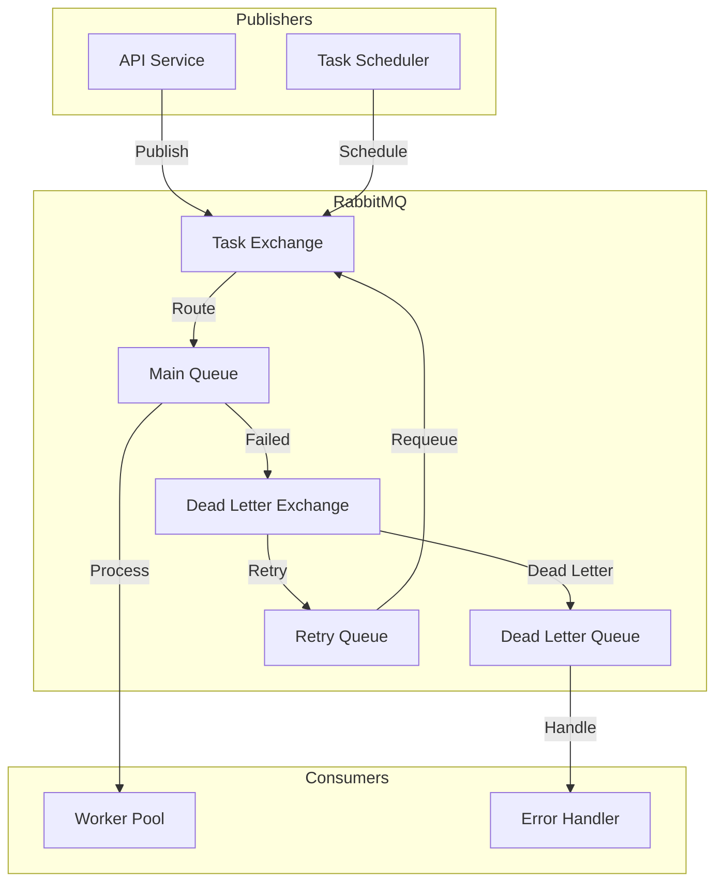

# 🐰 RabbitMQ Message Queue System

<div align="center">

*Distributed task processing system using RabbitMQ for the Rust Web Scraper*

[Architecture](#architecture) •
[Implementation](#implementation-details) •
[Configuration](#configuration) •
[Testing](../testing/queue-testing.md)

</div>

## 📑 Table of Contents

<details open>
<summary><strong>Overview & Architecture</strong></summary>

- [Overview](#overview)
- [Architecture](#architecture)
- [Key Features](#key-features)
- [Queue Structure](#queue-structure)
</details>

<details open>
<summary><strong>Implementation</strong></summary>

- [Implementation Details](#implementation-details)
  - [Connection Management](#connection-management)
  - [Core Operations](#core-operations)
- [Message Flow](#message-flow)
  - [Task Publishing](#task-publishing)
  - [Task Processing](#task-processing)
  - [Error Handling](#error-handling)
</details>

<details open>
<summary><strong>Queue Management</strong></summary>

- [Exchange Types](#exchange-types)
- [Queue Bindings](#queue-bindings)
- [Message Properties](#message-properties)
- [Dead Letter Handling](#dead-letter-handling)
</details>

## Overview

The RabbitMQ system serves as the backbone for distributed task processing in our web scraping infrastructure. It ensures reliable message delivery, handles task distribution, and provides robust error recovery mechanisms.

> 📘 **Testing Documentation**
>
> For detailed information about testing strategies and implementation, please refer to our [Queue Testing Guide](../testing/queue-testing.md).

## Architecture



## Key Features

- **Reliable Message Delivery**: At-least-once delivery guarantee
- **Dead Letter Handling**: Automatic handling of failed messages
- **Retry Mechanism**: Configurable retry policies with exponential backoff
- **Priority Queues**: Support for task prioritization
- **Message TTL**: Automatic message expiration
- **Consumer Prefetch**: Optimized message distribution

## Queue Structure

### Exchange Configuration
```rust
pub struct ExchangeConfig {
    name: String,
    kind: ExchangeKind,
    durable: bool,
    auto_delete: bool,
    arguments: HashMap<String, AMQPValue>,
}

impl ExchangeConfig {
    pub fn new_task_exchange() -> Self {
        Self {
            name: "scraper.tasks".into(),
            kind: ExchangeKind::Topic,
            durable: true,
            auto_delete: false,
            arguments: HashMap::new(),
        }
    }
}
```

### Queue Configuration
```rust
pub struct QueueConfig {
    name: String,
    durable: bool,
    exclusive: bool,
    auto_delete: bool,
    arguments: HashMap<String, AMQPValue>,
}

impl QueueConfig {
    pub fn with_dead_letter(mut self, exchange: &str) -> Self {
        self.arguments.insert(
            "x-dead-letter-exchange".into(),
            AMQPValue::LongString(exchange.into()),
        );
        self
    }
}
```

## Implementation Details

### Connection Management

```rust
pub struct RabbitMQAdapter {
    connection: Connection,
    channel: Channel,
    config: RabbitMQConfig,
}

impl RabbitMQAdapter {
    pub async fn new(config: RabbitMQConfig) -> Result<Self, Error> {
        let connection = Connection::connect(
            &config.url,
            ConnectionProperties::default()
        ).await?;
        
        let channel = connection.create_channel().await?;
        
        // Set up exchanges and queues
        Self::setup_infrastructure(&channel, &config).await?;
        
        Ok(Self {
            connection,
            channel,
            config,
        })
    }
}
```

### Message Publishing

```rust
impl MessagePublisher for RabbitMQAdapter {
    async fn publish_task(&self, task: ScrapingTask) -> Result<(), Error> {
        let payload = serde_json::to_vec(&task)?;
        
        self.channel
            .basic_publish(
                &self.config.exchange,
                &task.routing_key(),
                BasicPublishOptions::default(),
                payload,
                BasicProperties::default()
                    .with_delivery_mode(2) // persistent
                    .with_priority(task.priority as u8)
                    .with_expiration(task.ttl.to_string()),
            )
            .await?;
            
        Ok(())
    }
}
```

### Message Consumption

```rust
impl MessageConsumer for RabbitMQAdapter {
    async fn consume_tasks(&self) -> Result<(), Error> {
        let mut consumer = self.channel
            .basic_consume(
                &self.config.queue,
                &self.config.consumer_tag,
                BasicConsumeOptions::default(),
                FieldTable::default(),
            )
            .await?;

        while let Some(delivery) = consumer.next().await {
            let delivery = delivery?;
            match self.process_delivery(delivery).await {
                Ok(_) => delivery.ack(BasicAckOptions::default()).await?,
                Err(e) => {
                    delivery.nack(BasicNackOptions {
                        requeue: false,
                        multiple: false,
                    }).await?;
                    error!("Failed to process message: {}", e);
                }
            }
        }
        
        Ok(())
    }
}
```

## Error Handling

### Retry Policy
```rust
pub struct RetryPolicy {
    max_retries: u32,
    initial_delay: Duration,
    backoff_factor: f32,
    max_delay: Duration,
}

impl RetryPolicy {
    pub fn calculate_delay(&self, retry_count: u32) -> Duration {
        let delay = self.initial_delay.as_secs_f32() 
            * self.backoff_factor.powi(retry_count as i32);
        Duration::from_secs_f32(delay.min(self.max_delay.as_secs_f32()))
    }
}
```

### Dead Letter Handling
```rust
impl RabbitMQAdapter {
    async fn handle_dead_letter(&self, delivery: Delivery) -> Result<(), Error> {
        let retry_count = delivery
            .properties
            .headers()
            .and_then(|h| h.get("x-retry-count"))
            .and_then(|v| v.as_u32())
            .unwrap_or(0);

        if retry_count < self.config.retry_policy.max_retries {
            self.schedule_retry(delivery, retry_count + 1).await
        } else {
            self.move_to_dead_letter(delivery).await
        }
    }
}
```

## Monitoring & Metrics

### Queue Metrics
```rust
lazy_static! {
    static ref MESSAGES_PUBLISHED: Counter = Counter::new(
        "rabbitmq_messages_published_total",
        "Total number of messages published"
    ).unwrap();
    
    static ref MESSAGES_CONSUMED: Counter = Counter::new(
        "rabbitmq_messages_consumed_total",
        "Total number of messages consumed"
    ).unwrap();
    
    static ref PROCESSING_TIME: Histogram = Histogram::new(
        "rabbitmq_message_processing_seconds",
        "Message processing time in seconds"
    ).unwrap();
}
```

## Best Practices

1. **Message Persistence**
   - Use durable exchanges and queues
   - Set persistent delivery mode
   - Implement message acknowledgment

2. **Error Handling**
   - Implement dead letter queues
   - Use retry queues with backoff
   - Monitor failed messages

3. **Performance**
   - Configure appropriate prefetch counts
   - Use consumer acknowledgments
   - Implement channel pooling

4. **Monitoring**
   - Track queue lengths
   - Monitor consumer health
   - Track processing times

## 🐳 Docker Configuration

```yaml
rabbitmq:
  image: rabbitmq:3.12-management-alpine
  container_name: rust_scraper_rabbitmq
  ports:
    - "5672:5672"   # AMQP
    - "15672:15672" # Management UI
  environment:
    - RABBITMQ_DEFAULT_USER=${RABBITMQ_USER}
    - RABBITMQ_DEFAULT_PASS=${RABBITMQ_PASSWORD}
  volumes:
    - rabbitmq_data:/var/lib/rabbitmq
    - ./docker/rabbitmq/rabbitmq.conf:/etc/rabbitmq/rabbitmq.conf:ro
``` 