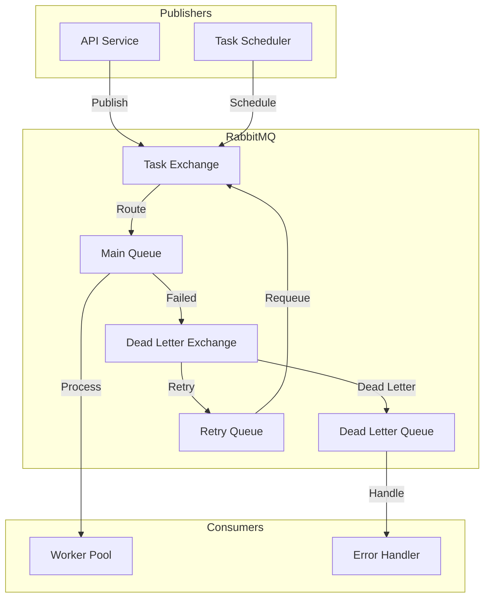
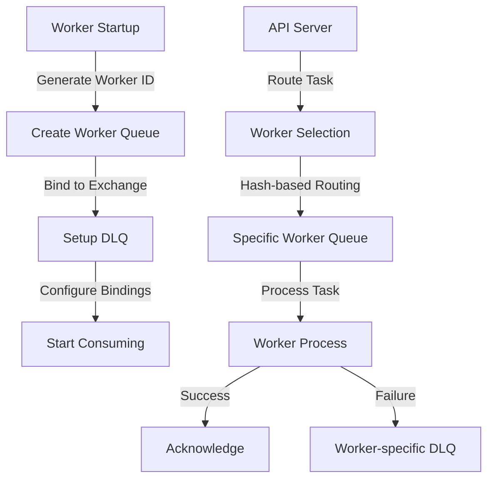

# 🐰 RabbitMQ Message Queue System


[Architecture](#architecture) •
[Implementation](#implementation-details) •
[Configuration](#configuration) •
[Testing](../testing/queue-testing.md)


<div align="center">

*Documentation for the RabbitMQ message queue implementation*

</div>

## 📑 Table of Contents

<details open>
<summary><strong>Core System</strong></summary>

- [Introduction](#introduction)
- [Current Configuration](#current-configuration)
- [Architecture](#architecture)
- [Implementation Details](#implementation-details)
</details>

<details open>
<summary><strong>Operations & Management</strong></summary>

- [Local Development Setup](#-local-development-environment)
- [Monitoring & Metrics](#monitoring--metrics)
- [Maintenance and Operations](#-maintenance-and-operations)
- [Troubleshooting Guide](#troubleshooting-guide)
</details>

<details open>
<summary><strong>Scaling & Evolution</strong></summary>

- [Scaling the System](#-scaling-the-system)
- [Queue Service Interchangeability](#-queue-service-interchangeability)
- [System Improvements Roadmap](#-system-improvements-roadmap)
</details>

<details open>
<summary><strong>Configuration & Best Practices</strong></summary>

- [Docker Configuration](#-docker-configuration)
- [Best Practices](#best-practices)
- [Migration Strategies](#migration-strategy)
</details>

## Introduction

The RabbitMQ message queue system serves as the backbone of our distributed task processing architecture. It enables reliable, asynchronous communication between the API server and worker nodes, ensuring efficient distribution and processing of scraping tasks.

## Architecture



### Current Configuration

Our RabbitMQ setup implements a per-worker queue architecture:

1. **Exchange Configuration**
   - Name: `scraper.tasks`
   - Type: Direct Exchange
   - Durability: Enabled
   - Auto-delete: Disabled
   - Routes tasks to specific worker queues based on routing keys

2. **Worker Queues**
   - Pattern: `scraping_tasks_worker_{id}` (one queue per worker)
   - Each worker has its dedicated queue
   - Durability: Enabled
   - Arguments:
     - `x-dead-letter-exchange`: `scraper.dlx`
     - `x-message-ttl`: 3600000 (1 hour)
   - Binding key: Matches worker ID

3. **Worker Management**
   - Each worker exclusively consumes from its queue
   - Worker ID is used as routing key
   - Automatic queue creation on worker startup
   - Queue cleanup on worker shutdown

4. **Load Distribution**
   - Tasks are distributed using consistent hashing
   - Based on worker ID and task parameters
   - Ensures even distribution across workers
   - Maintains task affinity when needed

5. **Dead Letter Exchange (DLX)**
   - Name: `scraper.dlx`
   - Type: Direct Exchange
   - One DLQ per worker queue
   - Pattern: `scraping_tasks_failed_worker_{id}`

6. **Message Properties**
   - Persistence: Enabled
   - Priority: Supported (1-10)
   - Content Type: application/json
   - Delivery Mode: Persistent (2)
   - Routing Key: Contains worker ID

7. **Per-Worker Settings**
   - Prefetch Count: 10 (per worker)
   - Auto-acknowledge: Disabled
   - Consumer Tag: `scraper_worker_{id}`
   - Exclusive queue access

8. **Connection Details**
   - Port: 5672 (AMQP)
   - Management Port: 15672
   - Virtual Host: Default ("/")
   - SSL: Not enabled in development

This per-worker queue architecture provides:
- Dedicated message processing per worker
- No queue contention between workers
- Independent scaling of individual workers
- Isolated error handling per worker
- Better task distribution control
- Simplified worker management

### Queue Creation Flow


## Implementation Details

### Connection Management

```rust
pub struct RabbitMQAdapter {
    connection: Connection,
    channel: Channel,
    config: RabbitMQConfig,
}

impl RabbitMQAdapter {
    pub async fn new(config: RabbitMQConfig) -> Result<Self, Error> {
        let connection = Connection::connect(
            &config.url,
            ConnectionProperties::default()
        ).await?;
        
        let channel = connection.create_channel().await?;
        
        // Set up exchanges and queues
        Self::setup_infrastructure(&channel, &config).await?;
        
        Ok(Self {
            connection,
            channel,
            config,
        })
    }
}
```

### Message Publishing

```rust
impl MessagePublisher for RabbitMQAdapter {
    async fn publish_task(&self, task: ScrapingTask) -> Result<(), Error> {
        let payload = serde_json::to_vec(&task)?;
        
        self.channel
            .basic_publish(
                &self.config.exchange,
                &task.routing_key(),
                BasicPublishOptions::default(),
                payload,
                BasicProperties::default()
                    .with_delivery_mode(2) // persistent
                    .with_priority(task.priority as u8)
                    .with_expiration(task.ttl.to_string()),
            )
            .await?;
            
        Ok(())
    }
}
```

### Message Consumption

```rust
impl MessageConsumer for RabbitMQAdapter {
    async fn consume_tasks(&self) -> Result<(), Error> {
        let mut consumer = self.channel
            .basic_consume(
                &self.config.queue,
                &self.config.consumer_tag,
                BasicConsumeOptions::default(),
                FieldTable::default(),
            )
            .await?;

        while let Some(delivery) = consumer.next().await {
            let delivery = delivery?;
            match self.process_delivery(delivery).await {
                Ok(_) => delivery.ack(BasicAckOptions::default()).await?,
                Err(e) => {
                    delivery.nack(BasicNackOptions {
                        requeue: false,
                        multiple: false,
                    }).await?;
                    error!("Failed to process message: {}", e);
                }
            }
        }
        
        Ok(())
    }
}
```

## Error Handling

### Retry Policy
```rust
pub struct RetryPolicy {
    max_retries: u32,
    initial_delay: Duration,
    backoff_factor: f32,
    max_delay: Duration,
}

impl RetryPolicy {
    pub fn calculate_delay(&self, retry_count: u32) -> Duration {
        let delay = self.initial_delay.as_secs_f32() 
            * self.backoff_factor.powi(retry_count as i32);
        Duration::from_secs_f32(delay.min(self.max_delay.as_secs_f32()))
    }
}
```

### Dead Letter Handling
```rust
impl RabbitMQAdapter {
    async fn handle_dead_letter(&self, delivery: Delivery) -> Result<(), Error> {
        let retry_count = delivery
            .properties
            .headers()
            .and_then(|h| h.get("x-retry-count"))
            .and_then(|v| v.as_u32())
            .unwrap_or(0);

        if retry_count < self.config.retry_policy.max_retries {
            self.schedule_retry(delivery, retry_count + 1).await
        } else {
            self.move_to_dead_letter(delivery).await
        }
    }
}
```

## Monitoring & Metrics

### Queue Metrics
```rust
lazy_static! {
    static ref MESSAGES_PUBLISHED: Counter = Counter::new(
        "rabbitmq_messages_published_total",
        "Total number of messages published"
    ).unwrap();
    
    static ref MESSAGES_CONSUMED: Counter = Counter::new(
        "rabbitmq_messages_consumed_total",
        "Total number of messages consumed"
    ).unwrap();
    
    static ref PROCESSING_TIME: Histogram = Histogram::new(
        "rabbitmq_message_processing_seconds",
        "Message processing time in seconds"
    ).unwrap();
}
```

## Best Practices

1. **Message Persistence**
   - Use durable exchanges and queues
   - Set persistent delivery mode
   - Implement message acknowledgment

2. **Error Handling**
   - Implement dead letter queues
   - Use retry queues with backoff
   - Monitor failed messages

3. **Performance**
   - Configure appropriate prefetch counts
   - Use consumer acknowledgments
   - Implement channel pooling

4. **Monitoring**
   - Track queue lengths
   - Monitor consumer health
   - Track processing times

## 🐳 Scaling the System

### Understanding Queue Types

Our system supports different types of queues for various purposes. Each queue type is optimized for its specific use case:

1. **Scraping Queues**
   - Handles web scraping tasks
   - Higher priority for real-time requests
   - Configurable rate limiting
   - Automatic retry for failed scrapes

2. **Processing Queues**
   - Manages data processing tasks
   - Batch processing capabilities
   - Lower priority than scraping
   - Result aggregation

3. **Analytics Queues**
   - Handles analytics and reporting
   - Background processing
   - Data aggregation tasks
   - Long-running operations

### Worker Scaling Strategy

Our worker scaling system automatically adjusts the number of workers based on queue load:

1. **Dynamic Scaling**
   - Monitors queue length and processing times
   - Scales up when queue utilization > 80%
   - Scales down when utilization < 20%
   - Maintains minimum worker count for availability

2. **Load Balancing**
   - Round-robin distribution for even load
   - Least connections for optimal resource usage
   - Consistent hashing for related tasks
   - Priority-based routing for urgent tasks

3. **Health Monitoring**
   - Tracks worker performance metrics
   - Monitors resource utilization
   - Automatic worker replacement
   - Failure detection and recovery

## 🖥️ Local Development Environment

### Setting Up RabbitMQ

1. **Prerequisites**
   - Docker installed
   - At least 2GB RAM available
   - Ports 5672 and 15672 free

2. **Quick Start**
   ```bash
   docker-compose up -d rabbitmq
   ```
   This will:
   - Start RabbitMQ with management plugin
   - Configure default credentials
   - Set up required exchanges and queues
   - Enable monitoring

### Management UI Guide

The RabbitMQ Management UI is your control center for monitoring and managing the queue system:

1. **Accessing the UI**
   - URL: `http://localhost:15672`
   - Default credentials:
     - Username: `admin`
     - Password: `admin123`

2. **Key Features**
   - **Overview Tab**: 
     - System health status
     - Message rates
     - Node statistics
   
   - **Queues Tab**:
     - Queue lengths
     - Consumer count
     - Message rates
     - Memory usage

   - **Exchanges Tab**:
     - Binding configurations
     - Routing patterns
     - Exchange types

   - **Admin Tab**:
     - User management
     - Access control
     - Policy settings

## 📝 System Improvements Roadmap

### Current Limitations

1. **Scalability Constraints**
   - Single RabbitMQ node
   - Limited queue sharding
   - Basic load balancing
   - No automatic failover

2. **Monitoring Gaps**
   - Basic metrics collection
   - Limited alerting
   - No performance trending
   - Manual scaling decisions

### Planned Improvements

1. **Enhanced Reliability**
   - Circuit breaker implementation
   - Improved connection pooling
   - Automatic reconnection
   - Message persistence guarantees

2. **Better Monitoring**
   - Grafana dashboards
   - Prometheus metrics
   - Automated alerts
   - Performance tracking

3. **Advanced Features**
   - Message scheduling
   - Priority queues
   - Message routing patterns
   - Dead letter handling

### Infrastructure Evolution

1. **High Availability**
   - RabbitMQ clustering
   - Queue mirroring
   - Automatic failover
   - Disaster recovery

2. **Security Enhancements**
   - SSL/TLS encryption
   - VHOST isolation
   - Access control lists
   - Audit logging

## 🔧 Maintenance and Operations

### Regular Maintenance

1. **Queue Cleanup**
   - Remove stale messages
   - Archive old data
   - Clean dead letter queues
   - Update routing rules

2. **Performance Tuning**
   - Adjust prefetch counts
   - Optimize channel usage
   - Configure message TTL
   - Fine-tune memory allocation

### Troubleshooting Guide

1. **Common Issues**
   - Connection failures
   - Message accumulation
   - High memory usage
   - Slow processing

2. **Resolution Steps**
   - Check network connectivity
   - Verify credentials
   - Monitor resource usage
   - Review error logs

### Best Practices

1. **Message Handling**
   - Use persistent messages
   - Implement proper ACKs
   - Handle failures gracefully
   - Monitor processing times

2. **Resource Management**
   - Control channel creation
   - Manage connection pools
   - Monitor memory usage
   - Track queue growth

## 🐳 Docker Configuration

```yaml
rabbitmq:
  image: rabbitmq:3.12-management-alpine
  container_name: rust_scraper_rabbitmq
  ports:
    - "5672:5672"   # AMQP
    - "15672:15672" # Management UI
  environment:
    - RABBITMQ_DEFAULT_USER=${RABBITMQ_USER}
    - RABBITMQ_DEFAULT_PASS=${RABBITMQ_PASSWORD}
  volumes:
    - rabbitmq_data:/var/lib/rabbitmq
    - ./docker/rabbitmq/rabbitmq.conf:/etc/rabbitmq/rabbitmq.conf:ro
``` 

## 🔄 Queue Service Interchangeability

### Current Architecture Design

Our system follows the Hexagonal Architecture pattern, which allows us to swap out the message queue implementation with minimal changes:

1. **Core Domain Interface**
```rust
pub trait MessageQueue {
    async fn publish_task(&self, task: Task) -> Result<(), QueueError>;
    async fn consume_task(&self) -> Result<Option<Task>, QueueError>;
    async fn acknowledge(&self, task_id: TaskId) -> Result<(), QueueError>;
    async fn reject(&self, task_id: TaskId, requeue: bool) -> Result<(), QueueError>;
}
```

2. **Current Adapter Implementation**
```rust
pub struct RabbitMQAdapter {
    connection: Connection,
    channel: Channel,
    config: QueueConfig,
}

impl MessageQueue for RabbitMQAdapter {
    // Implementation specific to RabbitMQ
}
```

### Switching Queue Providers

To switch to a different message queue service (e.g., Apache Kafka, Redis Pub/Sub, AWS SQS), you would need to:

1. **Create New Adapter**
   - Implement the `MessageQueue` trait for the new service
   - Handle service-specific connection management
   - Map domain events to service-specific messages

2. **Update Configuration**
   - Add new configuration structure
   - Update environment variables
   - Modify Docker configuration

3. **Migration Steps**
   - Deploy new queue service
   - Implement message format conversion
   - Run both systems in parallel
   - Gradually migrate consumers
   - Verify no message loss

### Example: Switching to Redis Pub/Sub

```rust
pub struct RedisPubSubAdapter {
    client: Redis,
    config: RedisConfig,
}

impl MessageQueue for RedisPubSubAdapter {
    async fn publish_task(&self, task: Task) -> Result<(), QueueError> {
        let message = serialize_task(task)?;
        self.client.publish("tasks", message).await?;
        Ok(())
    }
    
    async fn consume_task(&self) -> Result<Option<Task>, QueueError> {
        let message = self.client.subscribe("tasks").await?;
        Ok(deserialize_task(message)?)
    }
}
```

### Example: Switching to AWS SQS

```rust
pub struct SQSAdapter {
    client: SqsClient,
    queue_url: String,
}

impl MessageQueue for SQSAdapter {
    async fn publish_task(&self, task: Task) -> Result<(), QueueError> {
        let message = serialize_task(task)?;
        self.client
            .send_message()
            .queue_url(&self.queue_url)
            .message_body(message)
            .send()
            .await?;
        Ok(())
    }
}
```

### Considerations When Switching

1. **Feature Parity**
   - Message persistence
   - Delivery guarantees
   - Error handling
   - Dead letter support
   - Message ordering
   - Priority support

2. **Performance Impact**
   - Latency differences
   - Throughput capabilities
   - Resource usage
   - Scaling characteristics

3. **Operational Changes**
   - Monitoring tools
   - Metrics collection
   - Alerting systems
   - Backup procedures

4. **Cost Implications**
   - Licensing costs
   - Infrastructure costs
   - Maintenance overhead
   - Support requirements

### Migration Strategy

1. **Planning Phase**
   - Evaluate new service features
   - Identify missing capabilities
   - Plan feature adaptations
   - Create rollback plan

2. **Implementation Phase**
   - Develop new adapter
   - Write conversion utilities
   - Update configuration
   - Add new metrics

3. **Testing Phase**
   - Unit test new adapter
   - Integration testing
   - Performance testing
   - Failure scenario testing

4. **Deployment Phase**
   - Deploy new service
   - Migrate test workloads
   - Monitor performance
   - Gradually shift traffic

5. **Validation Phase**
   - Verify message delivery
   - Check error handling
   - Validate metrics
   - Confirm no data loss

### Best Practices for Service Abstraction

1. **Interface Design**
   - Keep interfaces minimal
   - Use domain-specific types
   - Abstract provider details
   - Handle common patterns

2. **Error Handling**
   - Use generic error types
   - Map provider errors
   - Maintain error context
   - Provide recovery paths

3. **Configuration**
   - Use feature flags
   - Abstract credentials
   - Centralize settings
   - Document options

4. **Testing**
   - Mock interfaces
   - Test edge cases
   - Verify conversions
   - Simulate failures