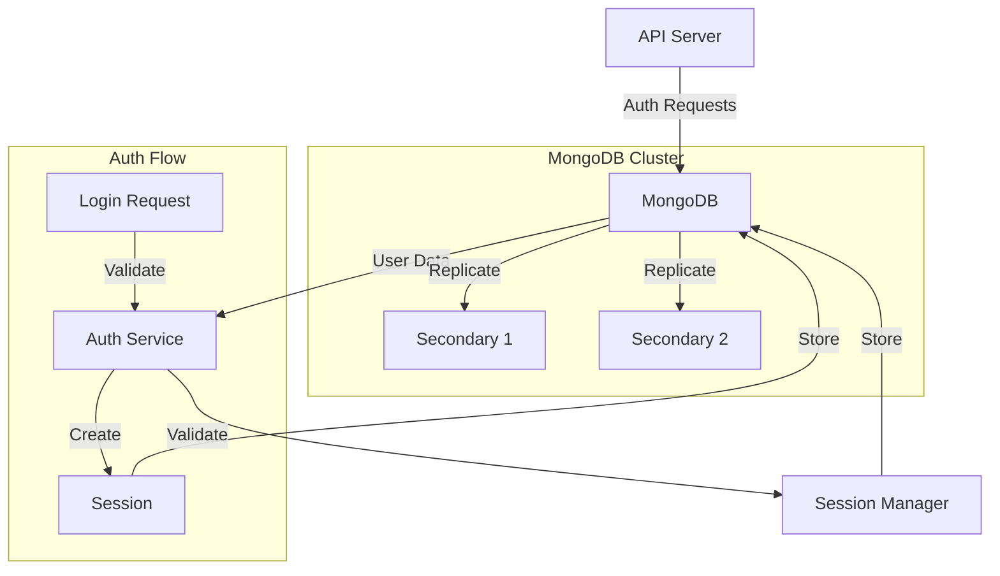

# 🗄️ MongoDB Configuration

<div align="center">

*Documentation for the MongoDB database configuration and implementation*

[Architecture](#architecture) •
[Implementation](#implementation-details) •
[Configuration](#configuration) •
[Testing](../testing/mongodb-testing.md)

</div>

## 📑 Table of Contents

<details open>
<summary><strong>Core System</strong></summary>

- [Introduction](#introduction)
- [Current Configuration](#current-configuration)
- [Architecture](#architecture)
- [Implementation Details](#implementation-details)
</details>

<details open>
<summary><strong>Operations & Management</strong></summary>

- [Local Development Setup](#-local-development-environment)
- [Monitoring & Metrics](#monitoring--metrics)
- [Backup & Recovery](#-backup--recovery)
- [Security](#-security)
</details>

<details open>
<summary><strong>Features & Schema</strong></summary>

- [Collections](#collections)
- [Indexes](#indexes)
- [Authentication](#authentication)
- [Data Models](#data-models)
</details>

## Introduction

MongoDB serves as our primary database for user authentication and authorization. It's configured for high availability and security, with optimized indexes for auth-related queries.

### Current Configuration

Our MongoDB setup consists of the following components:

1. **Database Configuration**
   - Version: MongoDB 6.0
   - Authentication: SCRAM-SHA-256
   - Transport: TLS/SSL enabled
   - Port: 27017

2. **Collections**
   - `users`: User authentication data
   - `sessions`: Active user sessions
   - `access_tokens`: API access tokens
   - `refresh_tokens`: Refresh tokens

3. **Indexes**
   ```javascript
   // Users collection
   db.users.createIndex({ "email": 1 }, { unique: true })
   db.users.createIndex({ "username": 1 }, { unique: true })
   
   // Sessions collection
   db.sessions.createIndex({ "user_id": 1 })
   db.sessions.createIndex({ "expires_at": 1 }, { expireAfterSeconds: 0 })
   
   // Access tokens collection
   db.access_tokens.createIndex({ "token": 1 }, { unique: true })
   db.access_tokens.createIndex({ "expires_at": 1 }, { expireAfterSeconds: 0 })
   ```

## Architecture



## Implementation Details

### Database Connection

```rust
#[derive(Debug, Clone)]
pub struct MongoConfig {
    pub uri: String,
    pub database: String,
    pub auth_source: String,
    pub min_pool_size: u32,
    pub max_pool_size: u32,
}

impl MongoConfig {
    pub fn from_env() -> Result<Self> {
        Ok(Self {
            uri: env::var("MONGODB_URI")?,
            database: env::var("MONGODB_DATABASE")?,
            auth_source: env::var("MONGODB_AUTH_SOURCE")
                .unwrap_or_else(|_| "admin".to_string()),
            min_pool_size: env::var("MONGODB_MIN_POOL_SIZE")
                .unwrap_or_else(|_| "5".to_string())
                .parse()?,
            max_pool_size: env::var("MONGODB_MAX_POOL_SIZE")
                .unwrap_or_else(|_| "10".to_string())
                .parse()?,
        })
    }
}
```

### Client Setup

```rust
pub struct MongoClient {
    client: Client,
    database: Database,
}

impl MongoClient {
    pub async fn new(config: MongoConfig) -> Result<Self> {
        let options = ClientOptions::parse(&config.uri).await?;
        let client = Client::with_options(options)?;
        let database = client.database(&config.database);
        
        Ok(Self { client, database })
    }
}
```

## 🖥️ Local Development Environment

### Docker Configuration

```yaml
mongodb:
  image: mongo:6.0
  container_name: rust_scraper_mongodb
  ports:
    - "27017:27017"
  environment:
    MONGO_INITDB_ROOT_USERNAME: ${MONGO_ROOT_USER}
    MONGO_INITDB_ROOT_PASSWORD: ${MONGO_ROOT_PASSWORD}
    MONGO_INITDB_DATABASE: ${MONGO_DATABASE}
  volumes:
    - mongodb_data:/data/db
    - ./docker/mongodb/init-mongo.js:/docker-entrypoint-initdb.d/init-mongo.js:ro
```

### Initial Setup Script

```javascript
// init-mongo.js
db.createUser({
    user: process.env.MONGO_USER,
    pwd: process.env.MONGO_PASSWORD,
    roles: [
        {
            role: "readWrite",
            db: process.env.MONGO_DATABASE
        }
    ]
});

// Create collections
db.createCollection("users");
db.createCollection("sessions");
db.createCollection("access_tokens");
db.createCollection("refresh_tokens");

// Create indexes
db.users.createIndex({ "email": 1 }, { unique: true });
db.users.createIndex({ "username": 1 }, { unique: true });
db.sessions.createIndex({ "user_id": 1 });
db.sessions.createIndex({ "expires_at": 1 }, { expireAfterSeconds: 0 });
```

## Data Models

### User Schema

```rust
#[derive(Debug, Serialize, Deserialize)]
pub struct User {
    #[serde(rename = "_id")]
    pub id: ObjectId,
    pub email: String,
    pub username: String,
    #[serde(with = "bson::serde_helpers::chrono_datetime_as_bson_datetime")]
    pub created_at: DateTime<Utc>,
    pub password_hash: String,
    pub role: UserRole,
    pub status: UserStatus,
}

#[derive(Debug, Serialize, Deserialize)]
pub enum UserRole {
    Admin,
    User,
}

#[derive(Debug, Serialize, Deserialize)]
pub enum UserStatus {
    Active,
    Inactive,
    Suspended,
}
```

### Session Schema

```rust
#[derive(Debug, Serialize, Deserialize)]
pub struct Session {
    #[serde(rename = "_id")]
    pub id: ObjectId,
    pub user_id: ObjectId,
    pub token: String,
    #[serde(with = "bson::serde_helpers::chrono_datetime_as_bson_datetime")]
    pub created_at: DateTime<Utc>,
    #[serde(with = "bson::serde_helpers::chrono_datetime_as_bson_datetime")]
    pub expires_at: DateTime<Utc>,
    pub ip_address: Option<String>,
    pub user_agent: Option<String>,
}
```

## 🔐 Security

### Authentication

1. **Database Authentication**
   - SCRAM-SHA-256 mechanism
   - Role-based access control
   - SSL/TLS encryption
   - Connection string authentication

2. **User Authentication**
   - Argon2 password hashing
   - Rate limiting on auth attempts
   - Session management
   - Token rotation

### Authorization

```rust
#[async_trait]
pub trait AuthorizationService {
    async fn authorize_user(&self, user_id: ObjectId, permission: Permission) -> Result<bool>;
    async fn get_user_permissions(&self, user_id: ObjectId) -> Result<Vec<Permission>>;
}

pub struct MongoAuthorizationService {
    db: Database,
}

impl MongoAuthorizationService {
    pub async fn authorize_request(&self, req: &Request) -> Result<()> {
        let token = self.extract_token(req)?;
        let session = self.validate_session(token).await?;
        let user = self.get_user(session.user_id).await?;
        
        if !self.has_permission(&user, req.permission()).await? {
            return Err(Error::Unauthorized);
        }
        
        Ok(())
    }
}
```

## 📊 Monitoring & Metrics

### Performance Metrics

```rust
lazy_static! {
    static ref MONGO_OPERATIONS: Counter = Counter::new(
        "mongodb_operations_total",
        "Total number of MongoDB operations"
    ).unwrap();
    
    static ref MONGO_OPERATION_DURATION: Histogram = Histogram::new(
        "mongodb_operation_duration_seconds",
        "MongoDB operation duration in seconds"
    ).unwrap();
    
    static ref MONGO_CONNECTION_ERRORS: Counter = Counter::new(
        "mongodb_connection_errors_total",
        "Total number of MongoDB connection errors"
    ).unwrap();
}
```

## Best Practices

1. **Connection Management**
   - Use connection pooling
   - Implement retry logic
   - Monitor pool metrics
   - Handle timeouts

2. **Query Optimization**
   - Use proper indexes
   - Limit query results
   - Use projections
   - Monitor slow queries

3. **Data Management**
   - Regular backups
   - Data validation
   - Schema versioning
   - Clean up old data

4. **Security**
   - Regular security audits
   - Access control reviews
   - SSL/TLS encryption
   - Secure configuration 