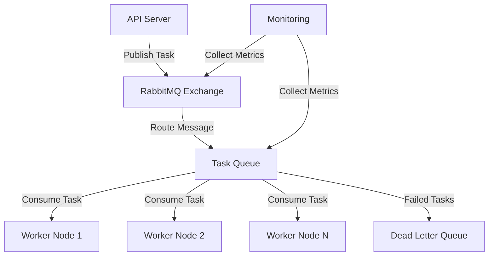

# 🐰 RabbitMQ Message Queue System

<div align="center">

*Documentation for the RabbitMQ message queue implementation*

</div>

## 📑 Table of Contents

<details open>
<summary><strong>Overview</strong></summary>

- [Introduction](#introduction)
- [Architecture](#architecture)
- [Key Features](#key-features)
</details>

<details open>
<summary><strong>Implementation</strong></summary>

- [Connection Management](#connection-management)
- [Message Publishing](#message-publishing)
- [Message Consumption](#message-consumption)
- [Error Handling](#error-handling)
</details>

<details open>
<summary><strong>Configuration & Operations</strong></summary>

- [Queue Configuration](#queue-configuration)
- [Monitoring & Metrics](#monitoring--metrics)
- [Performance Tuning](#performance-tuning)
- [Troubleshooting](#troubleshooting)
</details>

## Introduction

The RabbitMQ message queue system serves as the backbone of our distributed task processing architecture. It enables reliable, asynchronous communication between the API server and worker nodes, ensuring efficient distribution and processing of scraping tasks.

### Key Features

- Asynchronous task distribution
- Reliable message delivery
- Dead letter queues for failed tasks
- Priority-based queuing
- Message persistence
- Consumer scaling
- Automatic reconnection
- Metrics collection

## Architecture



## Implementation

### Connection Management

```rust
pub struct RabbitMQConnection {
    connection: Connection,
    channel: Channel,
    config: QueueConfig,
}

impl RabbitMQConnection {
    pub async fn new(config: QueueConfig) -> Result<Self> {
        let connection = Connection::connect(
            &config.url,
            ConnectionProperties::default()
        ).await?;
        
        let channel = connection.create_channel().await?;
        
        Ok(Self {
            connection,
            channel,
            config,
        })
    }
    
    pub async fn ensure_topology(&self) -> Result<()> {
        // Declare exchange
        self.channel
            .exchange_declare(
                &self.config.exchange,
                ExchangeKind::Direct,
                ExchangeDeclareOptions {
                    durable: true,
                    ..Default::default()
                },
                FieldTable::default(),
            )
            .await?;
            
        // Declare queues
        self.channel
            .queue_declare(
                &self.config.queue,
                QueueDeclareOptions {
                    durable: true,
                    ..Default::default()
                },
                FieldTable::default(),
            )
            .await?;
            
        Ok(())
    }
}
```

### Message Publishing

```rust
pub struct Publisher {
    channel: Channel,
    exchange: String,
    routing_key: String,
}

impl Publisher {
    pub async fn publish_task(&self, task: ScrapingTask) -> Result<()> {
        let payload = serde_json::to_vec(&task)?;
        
        self.channel
            .basic_publish(
                &self.exchange,
                &self.routing_key,
                BasicPublishOptions::default(),
                payload,
                BasicProperties::default()
                    .with_delivery_mode(2) // persistent
                    .with_priority(task.priority as u8)
                    .with_expiration(task.ttl.as_secs().to_string()),
            )
            .await?;
            
        Ok(())
    }
}
```

### Message Consumption

```rust
pub struct Consumer {
    channel: Channel,
    queue: String,
}

impl Consumer {
    pub async fn consume_tasks<F, Fut>(&self, handler: F) -> Result<()>
    where
        F: Fn(ScrapingTask) -> Fut,
        Fut: Future<Output = Result<()>>,
    {
        let mut consumer = self.channel
            .basic_consume(
                &self.queue,
                "scraper_worker",
                BasicConsumeOptions::default(),
                FieldTable::default(),
            )
            .await?;
            
        while let Some(delivery) = consumer.next().await {
            let delivery = delivery?;
            let task: ScrapingTask = serde_json::from_slice(&delivery.data)?;
            
            match handler(task).await {
                Ok(_) => {
                    delivery.ack(BasicAckOptions::default()).await?;
                }
                Err(_) => {
                    delivery.nack(BasicNackOptions {
                        requeue: false,
                        ..Default::default()
                    }).await?;
                }
            }
        }
        
        Ok(())
    }
}
```

## Configuration

### Queue Configuration

```rust
#[derive(Clone, Debug)]
pub struct QueueConfig {
    pub url: String,
    pub exchange: String,
    pub queue: String,
    pub routing_key: String,
    pub prefetch_count: u16,
    pub consumer_tag: String,
}

impl QueueConfig {
    pub fn from_env() -> Result<Self> {
        Ok(Self {
            url: env::var("RABBITMQ_URL")?,
            exchange: env::var("RABBITMQ_EXCHANGE")?,
            queue: env::var("RABBITMQ_QUEUE")?,
            routing_key: env::var("RABBITMQ_ROUTING_KEY")?,
            prefetch_count: env::var("RABBITMQ_PREFETCH_COUNT")?
                .parse()?,
            consumer_tag: env::var("RABBITMQ_CONSUMER_TAG")?,
        })
    }
}
```

### Docker Configuration

```yaml
rabbitmq:
  image: rabbitmq:3.12-management-alpine
  container_name: scraper_rabbitmq
  ports:
    - "5672:5672"   # AMQP
    - "15672:15672" # Management UI
  environment:
    - RABBITMQ_DEFAULT_USER=scraper
    - RABBITMQ_DEFAULT_PASS=secret
  volumes:
    - rabbitmq_data:/var/lib/rabbitmq
  healthcheck:
    test: ["CMD", "rabbitmq-diagnostics", "check_port_connectivity"]
    interval: 30s
    timeout: 10s
    retries: 3
```

## Error Handling

### Retry Policy

```rust
#[derive(Clone, Debug)]
pub struct RetryPolicy {
    pub max_retries: u32,
    pub initial_delay: Duration,
    pub backoff_factor: f64,
    pub max_delay: Duration,
}

impl RetryPolicy {
    pub fn calculate_delay(&self, retry_count: u32) -> Duration {
        let delay = self.initial_delay.as_secs_f64() 
            * self.backoff_factor.powi(retry_count as i32);
            
        Duration::from_secs_f64(
            delay.min(self.max_delay.as_secs_f64())
        )
    }
}
```

### Dead Letter Handling

```rust
impl Consumer {
    pub async fn setup_dlq(&self) -> Result<()> {
        // Declare DLQ
        self.channel
            .queue_declare(
                "scraper_dlq",
                QueueDeclareOptions {
                    durable: true,
                    ..Default::default()
                },
                FieldTable::default(),
            )
            .await?;
            
        // Bind main queue with DLQ arguments
        let mut args = FieldTable::default();
        args.insert(
            "x-dead-letter-exchange".into(),
            AMQPValue::LongString("".into()),
        );
        args.insert(
            "x-dead-letter-routing-key".into(),
            AMQPValue::LongString("scraper_dlq".into()),
        );
        
        self.channel
            .queue_declare(
                &self.queue,
                QueueDeclareOptions {
                    durable: true,
                    ..Default::default()
                },
                args,
            )
            .await?;
            
        Ok(())
    }
}
```

## Monitoring & Metrics

### Prometheus Metrics

```rust
pub struct QueueMetrics {
    messages_published: Counter,
    messages_consumed: Counter,
    message_processing_duration: Histogram,
    consumer_errors: Counter,
    dlq_messages: Counter,
}

impl QueueMetrics {
    pub fn new() -> Result<Self> {
        Ok(Self {
            messages_published: Counter::new(
                "scraper_messages_published_total",
                "Total number of messages published"
            )?,
            messages_consumed: Counter::new(
                "scraper_messages_consumed_total",
                "Total number of messages consumed"
            )?,
            message_processing_duration: Histogram::new(
                "scraper_message_processing_duration_seconds",
                "Message processing duration in seconds"
            )?,
            consumer_errors: Counter::new(
                "scraper_consumer_errors_total",
                "Total number of consumer errors"
            )?,
            dlq_messages: Counter::new(
                "scraper_dlq_messages_total",
                "Total number of messages sent to DLQ"
            )?,
        })
    }
}
```

## Performance Tuning

### Consumer Prefetch

```rust
impl Consumer {
    pub async fn set_prefetch(&self, count: u16) -> Result<()> {
        self.channel
            .basic_qos(count, BasicQosOptions::default())
            .await?;
        Ok(())
    }
}
```

### Channel Pooling

```rust
pub struct ChannelPool {
    channels: Vec<Channel>,
    index: AtomicUsize,
}

impl ChannelPool {
    pub fn get_channel(&self) -> &Channel {
        let index = self.index
            .fetch_add(1, Ordering::SeqCst)
            % self.channels.len();
        &self.channels[index]
    }
}
```

## Best Practices

1. **Connection Management**
   - Use connection pools
   - Implement automatic reconnection
   - Handle connection failures gracefully

2. **Message Durability**
   - Enable persistent messages
   - Use durable queues
   - Implement proper acknowledgments

3. **Error Handling**
   - Implement retry policies
   - Use dead letter queues
   - Log failed messages

4. **Monitoring**
   - Track queue metrics
   - Monitor consumer health
   - Set up alerts

## Troubleshooting

### Common Issues

1. **Connection Failures**
   - Check network connectivity
   - Verify credentials
   - Check server status

2. **Message Loss**
   - Enable message persistence
   - Check acknowledgment settings
   - Monitor queue size

3. **Performance Issues**
   - Adjust prefetch count
   - Monitor memory usage
   - Check consumer count

### Debugging

```rust
#[derive(Debug)]
pub struct QueueDebugInfo {
    pub connection_status: ConnectionStatus,
    pub queue_stats: QueueStats,
    pub consumer_stats: ConsumerStats,
}

impl QueueDebugInfo {
    pub async fn collect(&self) -> Result<Self> {
        // Collect debug information
        let connection_status = self.check_connection().await?;
        let queue_stats = self.get_queue_stats().await?;
        let consumer_stats = self.get_consumer_stats().await?;
        
        Ok(Self {
            connection_status,
            queue_stats,
            consumer_stats,
        })
    }
}
``` 