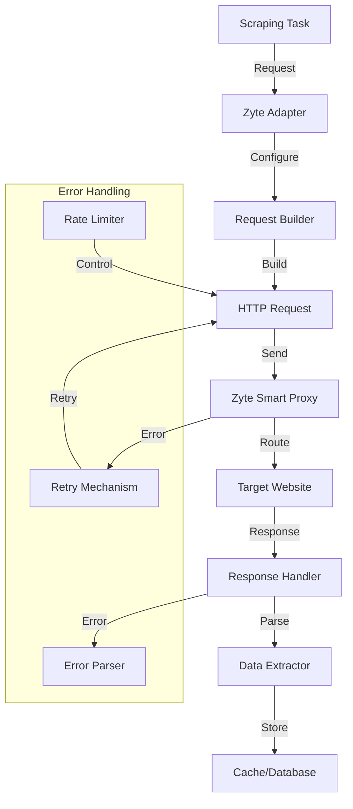

# 🕷️ Zyte Scraping Service

<div align="center">

*Documentation for the Zyte Smart Proxy Manager integration*

[Architecture](#architecture) •
[Implementation](#implementation-details) •
[Configuration](#configuration) •
[Testing](../testing/zyte-testing.md)

</div>

## 📑 Table of Contents

<details open>
<summary><strong>Core System</strong></summary>

- [Introduction](#introduction)
- [Current Configuration](#current-configuration)
- [Architecture](#architecture)
- [Implementation Details](#implementation-details)
</details>

<details open>
<summary><strong>Operations & Management</strong></summary>

- [Local Development Setup](#-local-development-environment)
- [Monitoring & Metrics](#monitoring--metrics)
- [Rate Limiting](#-rate-limiting)
- [Error Handling](#error-handling)
</details>

<details open>
<summary><strong>Features & Capabilities</strong></summary>

- [Smart Proxy Management](#-smart-proxy-management)
- [JavaScript Rendering](#-javascript-rendering)
- [Geolocation Targeting](#-geolocation-targeting)
- [Custom Headers & Cookies](#-custom-headers--cookies)
</details>

<details open>
<summary><strong>Configuration & Best Practices</strong></summary>

- [API Configuration](#-api-configuration)
- [Best Practices](#best-practices)
- [Troubleshooting](#troubleshooting)
</details>

## Introduction

The Zyte Smart Proxy Manager integration provides reliable web scraping capabilities with automatic proxy rotation, JavaScript rendering, and advanced request handling. It serves as our primary scraping engine, handling all outbound requests to target websites.

### Current Configuration

Our Zyte setup consists of the following components:

1. **API Configuration**
   - Service: Zyte Smart Proxy Manager
   - API Version: Latest
   - Authentication: API Key based
   - Base URL: `https://proxy.zyte.com:8011`

2. **Request Settings**
   - Default Timeout: 30 seconds
   - Auto Retry: Enabled (3 attempts)
   - Follow Redirects: Enabled
   - Verify SSL: Enabled

3. **Proxy Configuration**
   - Automatic Proxy Rotation
   - Country-specific Proxies: Available
   - Session Persistence: Supported
   - IP Sticky Sessions: Configurable

4. **Browser Rendering**
   - JavaScript Execution: Enabled
   - Wait for Selectors: Supported
   - Screenshot Capture: Available
   - Custom JavaScript Actions: Supported

## Architecture



## Implementation Details

### Request Configuration

```rust
pub struct ZyteConfig {
    api_key: String,
    base_url: String,
    timeout: Duration,
    max_retries: u32,
    country_code: Option<String>,
}

impl ZyteConfig {
    pub fn new(api_key: String) -> Self {
        Self {
            api_key,
            base_url: "https://proxy.zyte.com:8011".to_string(),
            timeout: Duration::from_secs(30),
            max_retries: 3,
            country_code: None,
        }
    }
}
```

### Client Implementation

```rust
pub struct ZyteClient {
    config: ZyteConfig,
    client: Client,
    metrics: Arc<ZyteMetrics>,
}

impl ZyteClient {
    pub async fn new(config: ZyteConfig) -> Result<Self> {
        let client = Client::builder()
            .timeout(config.timeout)
            .build()?;
            
        Ok(Self {
            config,
            client,
            metrics: Arc::new(ZyteMetrics::new()?),
        })
    }
}
```

## 🖥️ Local Development Environment

### Setting Up Zyte

1. **Prerequisites**
   - Zyte account and API key
   - Environment variables configured
   - Test websites identified

2. **Environment Configuration**
   ```bash
   export ZYTE_API_KEY="your-api-key"
   export ZYTE_PROXY_URL="http://proxy.zyte.com:8011"
   ```

### Testing Setup

```rust
#[cfg(test)]
mod tests {
    use super::*;
    
    fn setup_test_client() -> ZyteClient {
        let config = ZyteConfig {
            api_key: env::var("ZYTE_API_KEY").unwrap(),
            ..Default::default()
        };
        ZyteClient::new(config)
    }
}
```

## 📊 Monitoring & Metrics

### Performance Metrics

```rust
pub struct ZyteMetrics {
    requests_total: Counter,
    request_duration: Histogram,
    errors_total: Counter,
    retry_count: Counter,
}

impl ZyteMetrics {
    pub fn new() -> Result<Self> {
        Ok(Self {
            requests_total: Counter::new(
                "zyte_requests_total",
                "Total number of requests made"
            )?,
            request_duration: Histogram::new(
                "zyte_request_duration_seconds",
                "Request duration in seconds"
            )?,
            errors_total: Counter::new(
                "zyte_errors_total",
                "Total number of failed requests"
            )?,
            retry_count: Counter::new(
                "zyte_retry_count_total",
                "Total number of retries"
            )?,
        })
    }
}
```

## 🔄 Rate Limiting

### Rate Limiter Implementation

```rust
pub struct RateLimiter {
    permits: Semaphore,
    interval: Duration,
}

impl RateLimiter {
    pub fn new(requests_per_second: u32) -> Self {
        Self {
            permits: Semaphore::new(requests_per_second as usize),
            interval: Duration::from_secs(1),
        }
    }
    
    pub async fn acquire(&self) -> Result<()> {
        self.permits.acquire().await?;
        tokio::spawn(async move {
            tokio::time::sleep(self.interval).await;
            self.permits.add_permits(1);
        });
        Ok(())
    }
}
```

## Best Practices

1. **Request Optimization**
   - Use appropriate timeouts
   - Enable request compression
   - Minimize payload size
   - Cache responses when possible

2. **Error Handling**
   - Implement exponential backoff
   - Handle rate limits gracefully
   - Log detailed error information
   - Monitor failure patterns

3. **Resource Management**
   - Pool connections
   - Limit concurrent requests
   - Monitor bandwidth usage
   - Track proxy performance

4. **Data Quality**
   - Validate responses
   - Handle partial data
   - Check content integrity
   - Monitor success rates

## Troubleshooting

### Common Issues

1. **Connection Problems**
   - Check API key validity
   - Verify network connectivity
   - Confirm proxy availability
   - Check SSL/TLS settings

2. **Rate Limiting**
   - Monitor request rates
   - Check quota usage
   - Adjust concurrency
   - Implement backoff

3. **Data Quality**
   - Validate HTML structure
   - Check JavaScript execution
   - Verify CSS selectors
   - Monitor parsing success

### Resolution Steps

1. **Request Issues**
   ```rust
   impl ZyteClient {
       async fn handle_error(&self, error: Error) -> Result<()> {
           match error {
               Error::RateLimited => {
                   self.backoff().await?;
                   Ok(())
               }
               Error::ProxyError => {
                   self.rotate_proxy().await?;
                   Ok(())
               }
               _ => Err(error),
           }
       }
   }
   ```

2. **Response Validation**
   ```rust
   impl ZyteClient {
       fn validate_response(&self, response: Response) -> Result<Response> {
           if !response.status().is_success() {
               return Err(Error::InvalidResponse);
           }
           if response.content_length() == Some(0) {
               return Err(Error::EmptyResponse);
           }
           Ok(response)
       }
   }
   ```

## 🔐 Security Considerations

1. **API Key Management**
   - Secure storage
   - Regular rotation
   - Access monitoring
   - Audit logging

2. **Request Security**
   - SSL/TLS verification
   - Header sanitization
   - Input validation
   - Response scanning

3. **Data Protection**
   - Sensitive data handling
   - Response sanitization
   - Secure storage
   - Access control 