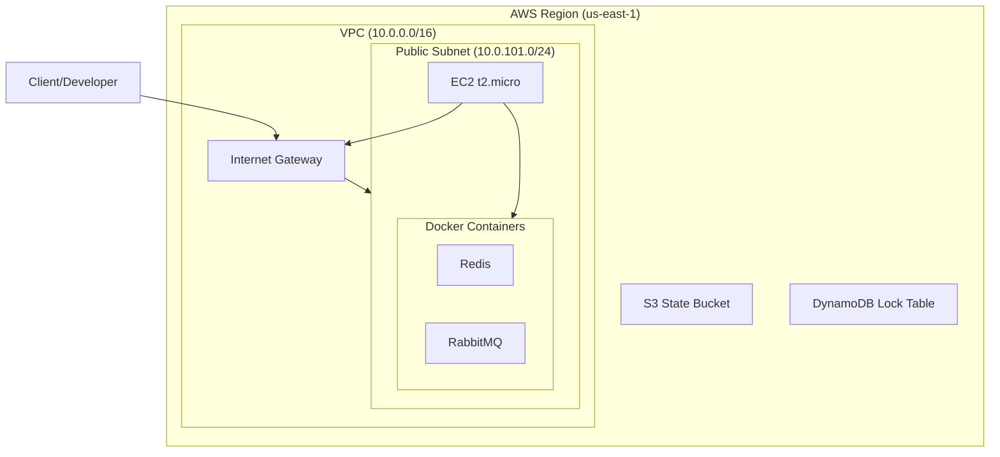
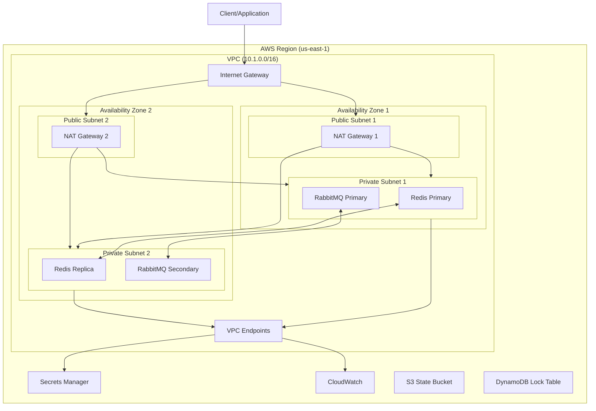
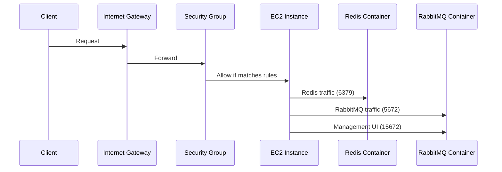

# Architecture Diagrams

## Development Environment

```mermaid
graph TB
    subgraph AWS["AWS Region (us-east-1)"]
        subgraph VPC["VPC (10.0.0.0/16)"]
            subgraph Public["Public Subnet (10.0.101.0/24)"]
                EC2["EC2 t2.micro"]
                subgraph Docker["Docker Containers"]
                    Redis["Redis"]
                    RMQ["RabbitMQ"]
                end
            end
            IGW["Internet Gateway"]
        end
        S3["S3 State Bucket"]
        DDB["DynamoDB Lock Table"]
    end
    
    Client["Client/Developer"] --> IGW
    IGW --> Public
    EC2 --> Docker
    EC2 --> IGW
```

## Production Environment

```mermaid
graph TB
    subgraph AWS["AWS Region (us-east-1)"]
        subgraph VPC["VPC (10.1.0.0/16)"]
            subgraph AZ1["Availability Zone 1"]
                subgraph Private1["Private Subnet 1"]
                    Redis1["Redis Primary"]
                    RMQ1["RabbitMQ Primary"]
                end
                subgraph Public1["Public Subnet 1"]
                    NAT1["NAT Gateway 1"]
                end
            end
            
            subgraph AZ2["Availability Zone 2"]
                subgraph Private2["Private Subnet 2"]
                    Redis2["Redis Replica"]
                    RMQ2["RabbitMQ Secondary"]
                end
                subgraph Public2["Public Subnet 2"]
                    NAT2["NAT Gateway 2"]
                end
            end
            
            IGW["Internet Gateway"]
            VPCe["VPC Endpoints"]
        end
        
        SM["Secrets Manager"]
        CW["CloudWatch"]
        S3["S3 State Bucket"]
        DDB["DynamoDB Lock Table"]
    end
    
    Client["Client/Application"] --> IGW
    IGW --> Public1 & Public2
    NAT1 & NAT2 --> Private1 & Private2
    Private1 & Private2 --> VPCe
    VPCe --> SM & CW
    Redis1 <--> Redis2
    RMQ1 <--> RMQ2
```

## Network Flow

```mermaid
sequenceDiagram
    participant C as Client
    participant IGW as Internet Gateway
    participant SG as Security Group
    participant EC2 as EC2 Instance
    participant R as Redis Container
    participant RMQ as RabbitMQ Container
    
    C->>IGW: Request
    IGW->>SG: Forward
    SG->>EC2: Allow if matches rules
    EC2->>R: Redis traffic (6379)
    EC2->>RMQ: RabbitMQ traffic (5672)
    EC2->>RMQ: Management UI (15672)
``` 